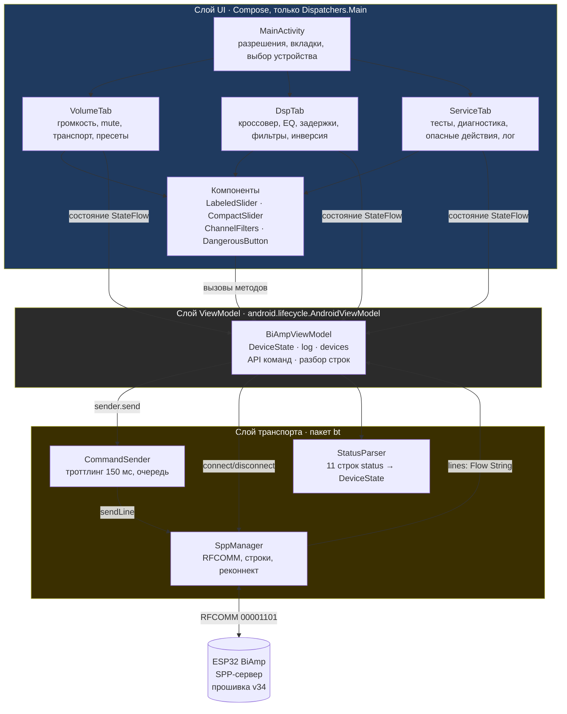
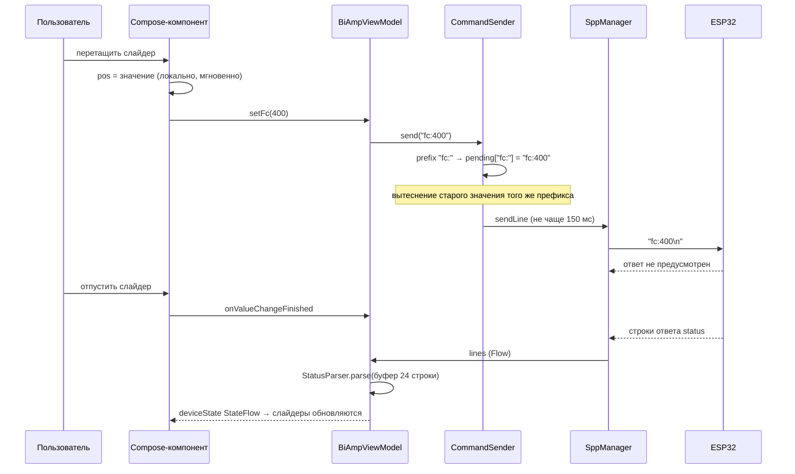
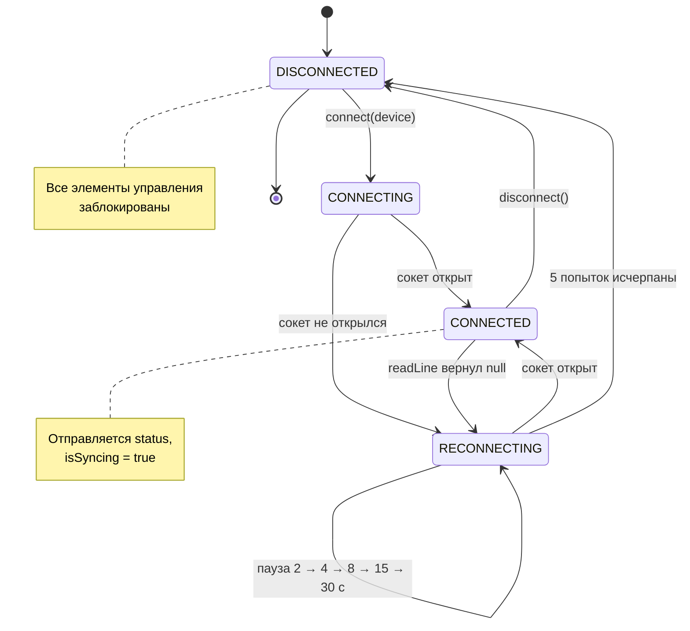
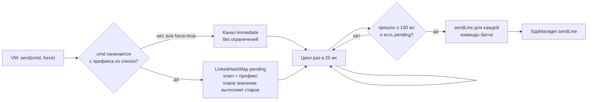

# BiAmp Control — техническая документация

**Пакет:** `com.kilo.biampcontrol` · **Версия приложения:** 1.0 (versionCode 1) · **Прошивка:** v34 · **Лицензия проекта:** см. `AGENTS.md`

Android-приложение для управления усилителем ESP32 BiAmp по Bluetooth SPP. Три вкладки,
терминальный доступ к диагностике, троттлинг команд и автовосстановление соединения.

Документация описывает прошивку **v34**. Предыдущая версия этого файла описывала прошивку v25
и содержала устаревший формат `status`; расхождения с прошивкой из неё устранены — см. раздел 6.

---

## Оглавление

- [1. Архитектурный обзор](#1-архитектурный-обзор)
  - [1.1 Схема слоёв и модулей](#11-схема-слоёв-и-модулей)
  - [1.2 Поток данных](#12-поток-данных)
  - [1.3 Машина состояний соединения](#13-машина-состояний-соединения)
  - [1.4 Схема троттлинга команд](#14-схема-троттлинга-команд)
  - [1.5 Структура проекта](#15-структура-проекта)
- [2. Установка и настройка окружения](#2-установка-и-настройка-окружения)
  - [2.1 Требования](#21-требования)
  - [2.2 JDK 17](#22-jdk-17)
  - [2.3 Android SDK](#23-android-sdk)
  - [2.4 Переменные окружения и local.properties](#24-переменные-окружения-и-localproperties)
  - [2.5 Расширения VSCode](#25-расширения-vscode)
  - [2.6 Сборка](#26-сборка)
  - [2.7 Установка на устройство](#27-установка-на-устройство)
  - [2.8 Разрешения](#28-разрешения)
- [3. Описание классов и функций](#3-описание-классов-и-функций)
  - [3.1 MainActivity](#31-mainactivity)
  - [3.2 BiAmpViewModel](#32-biampviewmodel)
  - [3.3 SppManager](#33-sppmanager)
  - [3.4 CommandSender](#34-commandsender)
  - [3.5 Protocol и StatusParser](#35-protocol-и-statusparser)
  - [3.6 Compose-компоненты](#36-compose-компоненты)
- [4. Протокол Bluetooth](#4-протокол-bluetooth)
  - [4.1 Параметры соединения](#41-параметры-соединения)
  - [4.2 Формат команд](#42-формат-команд)
  - [4.3 Полный список команд приложения](#43-полный-список-команд-приложения)
  - [4.4 Формат ответа status](#44-формат-ответа-status)
  - [4.5 Команды с ответом](#45-команды-с-ответом)
- [5. Сценарии использования](#5-сценарии-использования)
  - [5.1 Первое подключение](#51-первое-подключение)
  - [5.2 Настройка громкости и баланса](#52-настройка-громкости-и-баланса)
  - [5.3 Настройка кроссовера](#53-настройка-кроссовера)
  - [5.4 Развёртка динамиков через задержку](#54-развёртка-динамиков-через-задержку)
  - [5.5 Настройка эквалайзера](#55-настройка-эквалайзера)
  - [5.6 Диагностика каналов](#56-диагностика-каналов)
  - [5.7 Пресеты](#57-пресеты)
  - [5.8 Сценарии команд из кода](#58-сценарии-команд-из-кода)
- [6. Известные расхождения с прошивкой](#6-известные-расхождения-с-прошивкой)
- [7. Troubleshooting и FAQ](#7-troubleshooting-и-faq)
  - [7.1 Сборка](#71-сборка)
  - [7.2 Подключение](#72-подключение)
  - [7.3 Элементы управления](#73-элементы-управления)
  - [7.4 Отладка через ADB](#74-отладка-через-adb)
  - [7.5 FAQ](#75-faq)
- [8. Приложения](#8-приложения)
  - [8.1 Зависимости](#81-зависимости)
  - [8.2 Карта каналов и команд DSP](#82-карта-каналов-и-команд-dsp)
  - [8.3 Параметры троттлинга](#83-параметры-троттлинга)
  - [8.4 Стиль кода](#84-стиль-кода)

---

## 1. Архитектурный обзор

Приложение построено на четырёх слоях с односторонней зависимостью: UI знает о ViewModel,
ViewModel — о транспортном пакете `bt`, транспортный пакет ничего не знает об Android и UI.



### 1.1 Схема слоёв и модулей

| Слой | Пакет / файлы | Ответственность |
|---|---|---|
| UI | `MainActivity.kt`, `ui/*.kt` | Отрисовка, ввод, запрос разрешений, навигация |
| ViewModel | `BiAmpViewModel.kt` | Хранение состояния, API команд, приём и разбор строк |
| Транспорт | `bt/SppManager.kt` | Сокет, подключение, реконнект, построчное чтение |
| Транспорт | `bt/CommandSender.kt` | Троттлинг и очередь команд |
| Протокол | `bt/Protocol.kt` | Модель `DeviceState` и парсер ответа `status` |

### 1.2 Поток данных



Ключевая особенность: локальное значение `pos` в компоненте обновляется **мгновенно** при
перетаскивании, а на устройство уходит не чаще одного раза в 150 мс. Это даёт плавный интерфейс
при минимальной нагрузке на SPP.

### 1.3 Машина состояний соединения



Значения `ConnState` и их отображение в интерфейсе:

| Состояние | Индикатор в шапке | Доступность элементов |
|---|---|---|
| `DISCONNECTED` | `OFF`, красный | заблокированы, кроме «Подкл.» |
| `CONNECTING` | `...`, янтарный | заблокированы |
| `CONNECTED` | `ON`, зелёный | активны |
| `RECONNECTING` | `RE`, янтарный | заблокированы, доступна «Откл.» |

### 1.4 Схема троттлинга команд



### 1.5 Структура проекта

```
android-app/
├── settings.gradle.kts          # репозитории, имя проекта, модули
├── build.gradle.kts             # версии плагинов
├── local.properties             # sdk.dir (в .gitignore)
├── gradlew / gradlew.bat        # Gradle wrapper 8.9
├── gradle.properties
├── AGENTS.md                    # репозиторно-специфичные факты
├── SPECIFICATION.md                        # техническое задание
├── docs\
│   ├── DOCUMENTATION.md         # настоящий документ
│   └── ProjectStructureReport.md
├── app\
│   ├── build.gradle.kts         # конфигурация модуля и зависимости
│   └── src\main\
│       ├── AndroidManifest.xml
│       ├── assets\BiAmpControl.md   # встроенное руководство для диалога
│       └── java\com\kilo\biampcontrol\
│           ├── MainActivity.kt
│           ├── BiAmpViewModel.kt
│           ├── bt\
│           │   ├── SppManager.kt
│           │   ├── CommandSender.kt
│           │   └── Protocol.kt
│           └── ui\
│               ├── VolumeTab.kt
│               ├── DspTab.kt
│               ├── ServiceTab.kt
│               ├── LabeledSlider.kt
│               ├── CompactSlider.kt
│               ├── ChannelFilters.kt
│               └── theme\Theme.kt
```

---

## 2. Установка и настройка окружения

### 2.1 Требования

| Компонент | Версия | Обязателен |
|---|---|---|
| ОС | Windows 10/11, macOS или Linux | да |
| JDK | 17 (Temurin/OpenJDK) | да |
| Android SDK | platform 35, build-tools 35.0.0, platform-tools | да |
| Gradle | 8.9 (через wrapper) | да |
| Android Studio | любая версия | нет, сборка идёт из VSCode и CLI |
| Устройство ESP32 BiAmp | прошивка v34 | для проверки на железе |

Минимальная версия Android — **8.0 (API 26)**, целевая и компилируемая — **35**.

> **Важно.** Android Gradle Plugin 8.x требует ровно JDK 17. Более новый JDK 21 собирает проект,
> но выдаёт предупреждения о совместимости; JDK 11 и ниже не подходят вовсе.

### 2.2 JDK 17

Проверка текущей версии:

```powershell
java -version
```

Должно быть `17.x.x`. Если в системе несколько JDK, задайте нужный через переменную
окружения `JAVA_HOME` на одну сессию:

```powershell
$env:JAVA_HOME = "C:\Program Files\Eclipse Adoptium\jdk-17.0.13.11-hotspot"
.\gradlew.bat assembleDebug
```

### 2.3 Android SDK

Достаточно установить только `cmdline-tools`; Android Studio не обязателен.

```powershell
sdkmanager.bat "platform-tools" "platforms;android-35" "build-tools;35.0.0"
```

| Переменная | Значение | Зачем |
|---|---|---|
| `ANDROID_HOME` | `C:\Android\Sdk` | корень SDK |
| `ANDROID_SDK_ROOT` | `C:\Android\Sdk` | устаревшее имя, некоторые инструменты читают только его |
| `PATH` | добавить `%ANDROID_HOME%\platform-tools` | команда `adb` из любой папки |

Внутри `cmdline-tools` обязательна вложенная папка `latest` — распаковывать архив нужно так,
чтобы получилось `C:\Android\Sdk\cmdline-tools\latest\bin\sdkmanager.bat`. Без `latest`
`local.properties` не подхватится.

### 2.4 Переменные окружения и local.properties

Файл `local.properties` в корне репозитория указывает путь к SDK и не коммитится:

```properties
sdk.dir=C:\\Android\\Sdk
```

Обратите внимание на двойные обратные слэши — формат свойств Java. Файл создаётся один раз
вручную либо генерируется при первой сборке из Android Studio.

### 2.5 Расширения VSCode

Без Android Studio редактирование возможно только в VSCode, и набор расширений обязателен:

| Расширение | Назначение |
|---|---|
| Extension Pack for Java | подсветка, рефакторинг, отладка Java/Kotlin |
| Kotlin (`mathiasfrohlich.vscode-kotlin`) | навигация по Kotlin-коду |
| Gradle for Java | импорт и выполнение задач Gradle |
| XML | подсветка `AndroidManifest.xml` |

### 2.6 Сборка

```powershell
cd android-app
.\gradlew.bat assembleDebug
```

Результат:

```
app\build\outputs\apk\debug\app-debug.apk
```

Полезные варианты:

| Команда | Что делает |
|---|---|
| `.\gradlew.bat clean` | удаляет каталог `build` |
| `.\gradlew.bat assembleRelease` | сборка release без минимизации (`isMinifyEnabled = false`) |
| `.\gradlew.bat :app:installDebug` | сборка и установка на подключённое устройство |
| `.\gradlew.bat lint` | статический анализ Android Lint |

Первая сборка занимает 2–4 минуты: скачиваются дистрибутив Gradle 8.9 и зависимости.
Последующие — 5–20 секунд.

### 2.7 Установка на устройство

```powershell
adb devices
adb install -r app\build\outputs\apk\debug\app-debug.apk
```

Флаг `-r` переустанавливает поверх существующей версии с сохранением данных.

При проводном подключении к устройству на LineageOS драйверы обычно не нужны. Если
`adb devices` пуст, поставьте Google USB-драйвер:

```powershell
sdkmanager.bat "extras;google;usb_driver"
```

Беспроводной вариант (удобнее, когда телефон под рукой не лежит):

```powershell
adb pair <ip>:<port>
adb connect <ip>:<port>
adb install -r app\build\outputs\apk\debug\app-debug.apk
```

### 2.8 Разрешения

Приложение работает с Bluetooth, поэтому начиная с Android 12 (API 31) требуется
`BLUETOOTH_CONNECT` и `BLUETOOTH_SCAN`. На более старых версиях — классические
`BLUETOOTH`/`BLUETOOTH_ADMIN` и доступ к местоположению.

`MainActivity.ensurePermissions()` запрашивает набор разрешений в зависимости от версии ОС
одним вызовом `RequestMultiplePermissions`. Дальше проверок в коде нет: если пользователь
отказал, список сопряжённых устройств останется пустым, а диалог подключения покажет
подсказку о спаривании.

| Разрешение | API | Зачем |
|---|---|---|
| `BLUETOOTH_CONNECT` | 31+ | открыть RFCOMM-сокет к устройству |
| `BLUETOOTH_SCAN` | 31+ | чтение списка сопряжённых устройств |
| `BLUETOOTH`, `BLUETOOTH_ADMIN` | ≤30 | то же самое на старых версиях |
| `ACCESS_FINE_LOCATION`, `ACCESS_COARSE_LOCATION` | ≤30 | обязательны для сканирования BT до Android 11 |

В `AndroidManifest.xml` все разрешения объявлены с `maxSdkVersion="30"` там, где они нужны
только старым версиям.

---

## 3. Описание классов и функций

### 3.1 MainActivity

`MainActivity` — единственная Activity приложения, наследует `ComponentActivity`.

| Член | Назначение |
|---|---|
| `btPermissions` | массив разрешений, выбирается по `Build.VERSION.SDK_INT` |
| `permLauncher` | `RequestMultiplePermissions`, результат игнорируется |
| `ensurePermissions()` | фильтрует уже выданные разрешения и запрашивает недостающие |
| `onCreate()` | вызывает `ensurePermissions()`, затем `setContent { BiAmpTheme { ... } }` |

Внутри `setContent` размещается `MainScreen(vm)` — `@Composable`-функция верхнего уровня,
получающая `BiAmpViewModel` через `by viewModels()`.

`MainScreen` отвечает за каркас:

- `TopAppBar` с заголовком «BiAmp Control» и индикатором соединения — цветной `Surface`
  с подписью `ON` / `...` / `RE` / `OFF`;
- кнопка «Подкл.» в состояниях `DISCONNECTED` и `CONNECTING`, кнопка «Откл.» — в
  `CONNECTED` и `RECONNECTING`;
- `NavigationBar` с тремя вкладками: «Громкость», «DSP», «Сервис»;
- диалог выбора устройства из списка `vm.devices`.

Вкладки реализованы через `when (selectedTab)` над целочисленным состоянием, без
навигационного графа — переключение мгновенное, состояние вкладок не переживает поворот экрана.

### 3.2 BiAmpViewModel

`BiAmpViewModel : AndroidViewModel` — единственное хранилище состояния. UI не обращается
ни к сокету, ни к парсеру напрямую.

**Публичное состояние (StateFlow):**

| Поток | Тип | Содержимое |
|---|---|---|
| `connState` | `StateFlow<ConnState>` | проксирует `spp.state` |
| `deviceState` | `MutableStateFlow<DeviceState>` | разобранный ответ `status` |
| `log` | `MutableStateFlow<List<String>>` | последние 50 строк SPP |
| `devices` | `MutableStateFlow<List<BluetoothDevice>>` | сопряжённые устройства |
| `isSyncing` | `MutableStateFlow<Boolean>` | идёт ли разбор ответа на `status` |
| `isMuted0`, `isMuted1` | `MutableStateFlow<Boolean>` | локальное состояние мьютов |

**Функции подключения:**

| Функция | Действие |
|---|---|
| `refreshDevices(context)` | читает `bondedDevices` адаптера, обновляет `devices` |
| `connect(dev)` | передаёт устройство в `SppManager` |
| `disconnect()` | обрывает соединение и запрещает автопереподключение |

**Функции команд.** Каждая команда — тонкая обёртка над `sender.send()`. Второй параметр
`force` определяет, уйдёт команда немедленно или через троттлинг.

| Группа | Функции | Команды |
|---|---|---|
| Громкость | `setVolBoth`, `setVol0`, `setVol1`, `setBal`, `toggleMute` | `vol:`, `v0:`, `v1:`, `bal:`, `mute:` |
| DSP | `setFc`, `setHp`, `setSub`, `setTlf`, `setThf`, `setEq`, `toggleInv`, `invOff`, `preset` | `fc:`, `hp:`, `sub:`, `tlf:`, `thf:`, `eql:`…`eqh:`, `inv:`, `preset:` |
| Кроссовер и каналы | `setXoType`, `setDelay`, `setChHp`, `setChLp` | `xotype:`, `delayC:`, `chhp:C:F`, `chlp:C:F` |
| Транспорт и сервис | `transport`, `startTest`, `setTf`, `setTestVol`, `saveParams`, `reboot`, `factoryReset` | `play`…`prev`, `test:`, `tf:`, `tvol:`, `save`, `reboot`, `factory` |
| Диагностика | `sendDiagnostic(cmd)` | произвольная команда с ответом |

**Механизм синхронизации.** `status` опрашивается каждые 3 секунды, но не чаще, чем
приходит предыдущий ответ:

```kotlin
private fun requestStatusSync() {
    isSyncing.value = true
    syncRequestedAt = System.currentTimeMillis()
    sender.send("status", true)
}
```

- `requestStatusSync()` — единственная точка, ставящая флаг. Вызывается при подключении и из
  цикла опроса.
- `statusPollLoop()` пропускает итерацию, если `isSyncing == true`. Без этой проверки два
  ответа наложились бы, и в буфер попали бы строки двух разных опросов.
- `onLine()` снимает флаг, как только `StatusParser.parse()` разобрал хотя бы одну строку.
- `syncWatchdog()` снимает флаг по таймауту в 2 секунды — иначе после одного потерянного
  ответа опрос встал бы навсегда.

**Разбор входящих строк:**

```kotlin
private fun onLine(line: String) {
    lineBuffer.addLast(line)
    if (lineBuffer.size > STATUS_LINES) lineBuffer.removeFirst()
    StatusParser.parse(lineBuffer)?.let {
        deviceState.value = it
        if (isSyncing.value) isSyncing.value = false
        if (StatusParser.isBlockEnd(line)) lineBuffer.clear()
    }
    log.value = (log.value + line).takeLast(LOG_LINES)
}
```

Строка `Delay: 0/0/0/0` замыкает блок `status` в прошивке, поэтому после неё буфер
очищается: следующий опрос начинается с чистого состояния. При подключении буфер также
очищается, иначе строки прежней сессии смешались бы с новыми.

### 3.3 SppManager

`SppManager` инкапсулирует RFCOMM-сокет и жизненный цикл соединения.

| Член | Назначение |
|---|---|
| `SPP_UUID` | `00001101-0000-1000-8000-00805F9B34FB` — стандартный профиль Serial Port |
| `RETRY_DELAYS` | `2, 4, 8, 15, 30` секунд — паузы между попытками переподключения |
| `state` | `StateFlow<ConnState>`, единственный источник правды о соединении |
| `lines` | `MutableSharedFlow<String>` с буфером 64 строки |
| `connect(dev)` | ставит `wantConnection` и запускает `connectLoop` в `viewModelScope` |
| `disconnect()` | снимает флаг, отменяет корутину, закрывает сокет |
| `sendLine(cmd)` | пишет `cmd + "\n"` и делает `flush()`, исключения глотает |

**Цикл подключения** выполняет до шести попыток. Сокет открывается через
`createInsecureRfcommSocketToServiceRecord()` — пара с PIN-кодом не требуется, как и
задумано для встроенного устройства. Всё сетевое происходит в `Dispatchers.IO`:
и `connect()`, и чтение обёрнуты в `withContext(Dispatchers.IO)`, а подключение — ещё и в
`withTimeoutOrNull(15_000)`.

**Цикл чтения** блокируется в `BufferedReader.readLine()` и завершается, когда поток
отдаёт `null` (устройство закрыло соединение) или корутина отменена. Это и есть сигнал
реконнекта: возврат из `readLoop` приводит к `closeQuietly()` и следующей итерации
внешнего цикла.

Отдельная оптимизация: `sendLine` не блокирует вызывающего. Исключение записи глотается —
мёртвый сокет обнаружит цикл чтения, иначе ошибка ушла бы в UI.

### 3.4 CommandSender

`CommandSender` разделяет команды на два потока.

| Поток | Что попадает | Ограничение |
|---|---|---|
| `immediate` (`Channel.UNLIMITED`) | команды без префикса из списка или с `force = true` | нет |
| `pending` (`LinkedHashMap`) | команды с префиксом из списка троттлинга | 150 мс на батч |

Список префиксов: `vol:`, `v0:`, `v1:`, `bal:`, `fc:`, `hp:`, `tlf:`, `thf:`, `eql:`,
`eqm:`, `eqh:`, `delay0:`…`delay3:`, `chhp:`, `chlp:`, `tf:`.

Ключ `pending` — сам префикс, значение — полная команда. Новое значение того же параметра
**вытесняет** старое, поэтому при быстром перетаскивании слайдера на устройство уходит
только последнее положение, а не двадцать промежуточных.

Рабочий цикл просыпается каждые 25 мс:

1. Дренирует `immediate` целиком, отправляя каждую команду.
2. Если прошло ≥ 150 мс с прошлого батча и `pending` непуст — отправляет накопленное и
   обновляет `lastBatchAt`.

Транспорт, пресеты, тесты и опасные команды помечены `force = true` и идут немедленно,
не дожидаясь окна троттлинга.

### 3.5 Protocol и StatusParser

**`DeviceState`** — неизменяемый снимок состояния устройства. Все поля имеют значения
по умолчанию, совпадающие с заводскими настройками прошивки, поэтому `DeviceState()` —
корректное состояние «до первого ответа».

| Поле | Тип | Источник |
|---|---|---|
| `vol0`, `vol1` | `Int` | `V0=15% V1=15%` |
| `bal` | `Float` | `bal=0` |
| `fc`, `hp` | `Float` | `Fc=400Hz hp=45Hz` |
| `subOn` | `Boolean` | `sub=ON` |
| `xoType` | `Int` | `XO: Butter` / `XO: LR4` |
| `tlf`, `thf` | `Float` | `TLF=0dB THF=-1dB` |
| `eql`, `eqm`, `eqh` | `Float` | `EQ: L= M= H=` |
| `inv` | `List<Boolean>` | `INV: 0100` |
| `btAudioOn`, `sppOn` | `Boolean` | `BT: ON | SPP: ON` |
| `srcKhz` | `String` | `Src: 44.1 kHz` |
| `testMode` | `Int` | `Test: 0` |
| `testVol` | `Int` | `TVol=6%` |
| `delays` | `List<Int>` | `Delay: 0/0/0/0` |
| `chFilters` | `List<Pair<Int, Int>>` | `CHF: 0/0 0/0 0/0 0/0` |

**`StatusParser.parse(lines)`** — терпимый построчный разбор. Каждая строка проверяется
набором регулярных выражений; подошедшие значения попадают в копию `DeviceState`.
Результат возвращается, только если распознана хотя бы одна строка, иначе `null`.

Такой подход выбран сознательно: пакеты SPP приходят пачками, строка может потеряться при
смене радиосоединения, а прошивка может добавить новую строку в `status`. Незакомпетентные
строки молча пропускаются, а не роняют разбор.

`reEq` допускает `EQ: L=0.00 M=0.00 H=0.00` — `String(float)` в Arduino печатает два
знака после запятой, тогда как `reVol` требует целых `V0=15%`, потому что прошивка печатает
`(int)(vol_z*100)`. Эти два формата различаются намеренно.

**`StatusParser.isBlockEnd(line)`** — проверка, что строка замыкает блок `status`.
Прошивка завершает блок строкой `Delay:`, и по ней вызывающий код очищает буфер строк.

### 3.6 Compose-компоненты

| Файл | Экспортируемые компоненты |
|---|---|
| `MainActivity.kt` | `MainActivity`, `TabItem`, `MainScreen` |
| `ui/VolumeTab.kt` | `VolumeTab` |
| `ui/DspTab.kt` | `DspTab`, `MAX_DELAY_SAMPLES` |
| `ui/ServiceTab.kt` | `ServiceTab`; внутренние `DocDialog`, `MdLine`, `DangerousButton` |
| `ui/ChannelFilters.kt` | `ChannelFilters` |
| `ui/LabeledSlider.kt` | `LabeledSlider` (две перегрузки) |
| `ui/CompactSlider.kt` | `CompactSlider` |
| `ui/theme/Theme.kt` | `BiAmpTheme` |
| `ui/theme/Color.kt` | константы палитры (`Blue400`, `DarkBackground` и др.) |

**`CompactSlider`** — обёртка над Material3 `Slider` высотой 28 dp вместо стандартных 48.
Низкий профиль нужен, потому что на вкладке DSP одновременно показано до 20 ползунков.
Компонент хранит собственное `pos` и синхронизирует его с внешним `value` через
`LaunchedEffect`, поэтому внешний поток обновлений не вызывает перекомпозицию во время
перетаскивания.

**`LabeledSlider`** — подпись слева, значение справа, ползунок под ними. Значение
форматируется как целое при `steps > 0` и как `%.1f` в остальных случаях. Есть
перегрузка, принимающая `State<Float>`, — для случаев, когда значение нужно менять из
нескольких мест.

**`EqRow`, `DelayRow`, `ChFilterRow`** — приватные компоненты, живущие внутри своих файлов.
У каждого есть кнопка сброса или выключатель; `DelayRow` дополнительно показывает задержку
в миллисекундах, вычисляя `samples / 44.1`.

**`DangerousButton`** — кнопка с обязательным подтверждением. `isDestructive = true`
окрашивает её в цвет `error`, поэтому «Заводской сброс» визуально отличается от
«Сохранить» и «Перезагрузка».

**`DocDialog` и `loadDoc`** — встроенное руководство. Файл `assets/BiAmpControl.md`
читается и разбирается минимальным упрощённым Markdown: заголовки `#`/`##`/`###`,
маркеры `-`/`*`, `**жирный**` и строки целиком в обратных кавычках. Полноценный Markdown
движок не подключался намеренно — это добавило бы мегабайт зависимости ради справочного
текста.

---

## 4. Протокол Bluetooth

### 4.1 Параметры соединения

| Параметр | Значение |
|---|---|
| Транспорт | Bluetooth Classic, профиль RFCOMM / SPP |
| UUID сервиса | `00001101-0000-1000-8000-00805F9B34FB` |
| Имя устройства | `ESP32 BiAmp Speaker` |
| Тип сокета на Android | `createInsecureRfcommSocketToServiceRecord` — без PIN |
| Терминатор команды | `\n` (прошивка принимает и `\r`) |
| Максимальная длина команды | 63 символа + терминатор |
| Кодировка | ASCII, команды и ответы в нижнем регистре |

Устройство одновременно работает как A2DP-приёмник (аудио) и SPP-сервер (управление).
Это два независимых соединения: аудио идёт отдельным каналом, команды — по RFCOMM.

### 4.2 Формат команд

Команда — одна строка в нижнем регистре, без пробелов и кавычек:

```
<имя>[:<аргумент>][:<аргумент>]
```

| Элемент | Описание |
|---|---|
| Имя | до 5 символов, всегда строчные |
| `:` | разделитель; часть после первого двоеточия — аргумент |
| Аргумент 1 | канал или индекс, в зависимости от команды |
| Аргумент 2 | числовое значение |

Числа передаются без кавычек и без единиц измерения: `vol:40`, `fc:600`, `delay0:35`.
Дробные значения используют точку как разделитель: `tlf:-1.5`. Прошивка применяет
`strtof`, поэтому принимает и целые, и дробные числа в одной записи.

Диапазоны проверяются **на стороне прошивки** функцией `safeCmdVal()`. Значение вне
диапазона приводит к тихому игнорированию команды — ответа и ошибки не будет.

### 4.3 Полный список команд приложения

| Команда | Аргументы | Диапазон в прошивке | Метод приложения | Троттлинг |
|---|---|---|---|---|
| `vol` | 0–100 | оба канала | `setVolBoth` | да |
| `v0` | 0–100 | левый канал | `setVol0` | да |
| `v1` | 0–100 | правый канал | `setVol1` | да |
| `bal` | −10…10 | баланс | `setBal` | да |
| `mute` | 0–1 | переключает мьют | `toggleMute` | нет |
| `fc` | 200–1000 Гц | частота кроссовера | `setFc` | да |
| `hp` | 20–80 Гц | сабсоник | `setHp` | да |
| `sub` | 0/1 | включение саба | `setSub` | нет |
| `tlf` | −6…3 дБ | трим НЧ | `setTlf` | да |
| `thf` | −6…3 дБ | трим ВЧ | `setThf` | да |
| `eql` | −12…12 дБ | полка Low | `setEq(0, …)` | да |
| `eqm` | −12…12 дБ | полка Mid | `setEq(1, …)` | да |
| `eqh` | −12…12 дБ | полка High | `setEq(2, …)` | да |
| `xotype` | 1–2 | 1 = Butterworth, 2 = LR4 | `setXoType` | нет |
| `inv` | 0–3 или `off` | инверсия фазы | `toggleInv`, `invOff` | нет |
| `chhp` | 0–20000 Гц | ВЧ-фильтр канала | `setChHp` | да |
| `chlp` | 0–20000 Гц | НЧ-фильтр канала | `setChLp` | да |
| `delay` | 0–220 | задержка канала, сэмплы | `setDelay` | да |
| `tvol` | 0–100 | громкость теста, % | `setTestVol` | да |
| `preset` | 0–3 | Flat / Voice / Night / Party | `preset` | нет |
| `test` | см. ниже | режим тест-сигнала | `startTest` | нет |
| `tf` | 20–20000 Гц | частота теста | `setTf` | да |
| `play` `pause` `next` `prev` | — | транспорт AVCRP | `transport` | нет |
| `status` | — | текущее состояние | автоопрос | нет |
| `stats` | — | счётчики тракта | `sendDiagnostic` | нет |
| `heap` | — | свободная куча | `sendDiagnostic` | нет |
| `help` | — | список команд | `sendDiagnostic` | нет |
| `save` | — | записать в NVS | `saveParams` | нет |
| `reboot` | — | перезагрузка | `reboot` | нет |
| `factory` | — | сброс к заводским | `factoryReset` | нет |

Значения `test:`: `off` (0), `all` (1), `l` (2), `r` (3), `woof` (4), `tweet` (5),
`1`…`4` (6–9), `anti` (10), `sweep` (11). Заводское значение — `off`.

> **Обратите внимание.** `delay` записывается слитно: `delay0:35`, а не `delay:0:35`.
> Так же записываются `chhp:2:800` и `chlp:2:800` — слитно, с двоеточием перед
> номером канала. Ошибка формата приводит к полному игнорированию команды.

### 4.4 Формат ответа status

Прошивка отвечает на `status` одиннадцатью строками в фиксированном порядке:

```
V0=15% V1=15% bal=0
Fc=400Hz hp=45Hz sub=ON
XO: Butter
TLF=0dB THF=-1dB
EQ: L=0.00 M=0.00 H=0.00
INV: 0000
BT: ON | SPP: ON
Src: 44.1 kHz
Test: 0 TVol=6%
CHF: 0/0 0/0 0/0 0/0
Delay: 0/0/0/0
```

| № | Строка | Формат | Примечание |
|---|---|---|---|
| 1 | Громкость | `V0=N% V1=N% bal=X` | целые проценты, баланс с точкой |
| 2 | Кроссовер | `Fc=NHz hp=NHz sub=ON\|OFF` | целые Гц |
| 3 | Тип кроссовера | `XO: Butter` \| `XO: LR4` | |
| 4 | Тримы | `TLF=XdB THF=XdB` | 6 знаков после точки |
| 5 | Эквалайзер | `EQ: L=X M=X H=X` | 2 знака после точки |
| 6 | Инверсия | `INV: 0100` | 4 символа, порядок каналов 0…3 |
| 7 | Связь | `BT: ON \| SPP: ON` | разделитель — вертикальная черта |
| 8 | Источник | `Src: 44.1 kHz` \| `Src: 48 kHz` | частота из переговоров A2DP |
| 9 | Тест | `Test: N TVol=N%` | режим и громкость тест-сигнала |
| 10 | Фильтры каналов | `CHF: h/l h/l h/l h/l` | 0 означает «фильтр выключен» |
| 11 | Задержки | `Delay: n/n/n/n` | сэмплы, 0…220 |

Прошивка печатает все ответы одновременно в USB и в SPP через функцию `say()`, поэтому
одновременный мониторинг по COM-порту и по Bluetooth показывает одинаковый вывод.

### 4.5 Команды с ответом

Большинство команд параметров ответа не имеют — прошивка просто применяет значение. Ответ
приходит только от диагностических и опасных команд.

| Команда | Ответ |
|---|---|
| `status` | 11 строк, см. 4.4 |
| `stats` | 9 строк со счётчиками аудиотракта |
| `heap` | `Free heap: 64660` |
| `help` | 10 строк со списком команд |
| `save` | `Saved` |
| `reboot` | `Rebooting...`, затем перезагрузка через 500 мс |
| `factory` | `Factory reset`, затем перезагрузка |
| `test:*` | `Test mode: N` |
| `tvol:N` | `Test volume: N%` |
| `preset:N` | `Preset N` |

Ответ на `stats` приходит построчно и содержит счётчики, полезные для диагностики треска:

```
Frames: 12158336
Blocks: 53518 AF: 12169088 Idle: 145916
Underrun: Z1=0 Z2=0
RingDrops: 0 BadSamples: 0
Clips: 0/0/0/0
Starve: n=37 max=55ms
DSP: max=2304us WR: max=8373us
Loop: max=39ms NVS: max=0ms
HeapMin: 15860
```

| Показатель | Что означает | Норма |
|---|---|---|
| `RingDrops` | кадры, потерянные из-за нехватки места в кольце | 0 |
| `BadSamples` | кадры с испорченным содержимым | 0 |
| `Underrun` | недоборы записи в I2S по каждому порту | 0 |
| `Clips` | срабатывания soft clip по каналам | 0 |
| `DSP max` | худшее время обработки блока, мкс | < 5500 |
| `WR max` | худшее время записи в I2S, мкс | < 20000 |
| `HeapMin` | минимум свободной кучи за сессию | > 8000 |

> **Команда `evlog` в приложении недоступна.** Прошивка отвечает на неё строкой
> `evlog: only via USB`, а сам журнал событий выводит только в COM-порт. В приложении
> кнопки для неё нет намеренно.

---

## 5. Сценарии использования

### 5.1 Первое подключение

1. Прошейте ESP32 прошивкой v34 и включите питание.
2. Спарьте телефон с устройством `ESP32 BiAmp Speaker` в системных настройках Bluetooth.
3. Запустите приложение. При первом запуске запросятся разрешения — разрешите все.
4. Нажмите «Подкл.» в правом верхнем углу и выберите устройство из списка.
5. Индикатор в шапке переключится с `OFF` на `...`, затем на `ON`.
6. В карточке «Диагностика» вкладки «Сервис» появится надпись «Синхронизация…», которая
   исчезнет после разбора первого ответа `status`.

### 5.2 Настройка громкости и баланса

Вкладка «Громкость»:

| Элемент | Команда | Особенность |
|---|---|---|
| Общая | `vol:N` | двигает оба канала сразу |
| Левая (L) | `v0:N` | |
| Правая (R) | `v1:N` | |
| Баланс | `bal:N` | шаг 1, диапазон −10…10 |
| Mute Л / Mute П | `mute:0` / `mute:1` | переключатель без аргумента состояния |

Чтобы задать одинаковую громкость, сначала двигайте «Общая», затем поправьте каналы
индивидуально. Мьют — именно переключатель: состояние устройства не возвращается в
`status`, поэтому приложение держит его локально в `mute0` / `mute1` и сбрасывает при
переподключении.

### 5.3 Настройка кроссовера

Вкладка «DSP», раздел «Кроссовер»:

1. **Fc** — частота раздела, 200…1000 Гц. Для большинства систем 400 Гц.
2. **Сабсоник HPF** — переключатель включения саба. Пока выключен, слайдер `HPF` скрыт.
3. **HPF** — срез саба, 20…80 Гц. Типичное значение 45 Гц.
4. **Тип кроссовера** — `Butterworth` (12 дБ/окт) или `LR4` (24 дБ/окт). LR4 даёт более
   крутой срез и лучше гасит излучение вне полосы, но слегка меняет тональность.

Любое изменение помечает параметры как изменённые, и прошивка пересчитывает фильтры,
сохраняя результат в NVS с задержкой 2 секунды.

### 5.4 Развёртка динамиков через задержку

Раздел «Задержка каналов» на вкладке «DSP» задаёт сдвиг фазы для выравнивания
излучателей по времени прихода.

1. Подайте на все каналы один и тот же сигнал — удобно режим `test:all`.
2. Определите, какие динамики слышат раньше, и увеличьвайте задержку именно на них,
   пока звук не станет слитным.
3. Шаг 1 сэмпл равен 22,7 мкс при 44.1 кГц. 220 сэмплов — 4.99 мс.

Порядок каналов в приложении и прошивке совпадает: `НЧ-Л`, `ВЧ-Л`, `НЧ-П`, `ВЧ-П`
(`delay0`…`delay3`).

> **Потолок 220 сэмплов — не произволен.** В прошивке `DELAY_BUF_SIZE = 256`, и линия
> задержки разворачивается кольцевым индексом, поэтому её полезная ёмкость меньше
> размера буфера. Приложение ограничивает слайдер той же константой
> `MAX_DELAY_SAMPLES`, что и прошивка, чтобы интерфейс не предлагал значения,
> которые устройство молча отбросит.

### 5.5 Настройка эквалайзера

Три полки в порядке `eql`, `eqm`, `eqh`:

| Полка | Частота | Диапазон |
|---|---|---|
| Low 120Hz | 120 Гц | ±12 дБ |
| Mid 1kHz | 1000 Гц | ±12 дБ |
| High 6kHz | 6000 Гц | ±12 дБ |

У каждой полки есть кнопка «0» для быстрого сброса. Пресеты меняют все три полки сразу,
поэтому после выбора пресета полки стоит довести вручную.

### 5.6 Диагностика каналов

Вкладка «Сервис», раздел «Тест динамиков» — девять кнопок:

| Кнопка | Команда | Что слышно |
|---|---|---|
| Все | `test:all` | тон на всех четырёх каналах |
| НЧ | `test:woof` | низкочастотный сигнал |
| ВЧ | `test:tweet` | высокочастотный сигнал |
| ch1…ch4 | `test:1`…`test:4` | по одному каналу |
| Анти | `test:anti` | противофазный сигнал для проверки взаимной компенсации |
| Свип | `test:sweep` | свип-переход |
| СТОП | `test:off` | выключение (красная кнопка) |

Поле «Гц» и кнопка «TF» меняют частоту тест-сигнала в пределах 20…20000 Гц — удобно,
чтобы поймать резонанс динамика или паразитный свист.

Слайдер «Громкость теста» управляет параметром `tvol`. Заводское значение 6 % выбрано
намеренно тихим: свип и «Анти» на высокой громкости легко повреждают динамики.

### 5.7 Пресеты

Кнопки «Flat», «Voice», «Night», «Party» на вкладке «Громкость» отправляют
`preset:0`…`preset:3`. Пресет меняет `Fc`, тримы, саб и все три полки эквалайзера:

| Пресет | Fc | TLF | THF | EQ Low / Mid / High |
|---|---|---|---|---|
| Flat | 400 | 0 | −1 | 0 / 0 / 0 |
| Voice | 500 | −2 | +1 | 0 / +2 / 0 |
| Night | 400 | −4 | −2 | 0 / 0 / 0 |
| Party | 350 | +3 | 0 | +2 / 0 / +1 |

Пресеты не трогают громкость, баланс, кроссовер, задержки и поканальные фильтры.
Изменения попадают в NVS автоматически через 2 секунды, отдельная команда `save` не нужна.

### 5.8 Сценарии команд из кода

Типичные вызовы при программном управлении:

```kotlin
// Громкость обеих зон с троттлингом — второе слово false отправляет через 150 мс
vm.setVolBoth(40)

// То же, но немедленно, минуя троттлинг
vm.setVolBoth(40, force = true)

// Развёртка: 3.4 мс на канале 1 (ВЧ-Л)
vm.setDelay(1, 150)

// Включение LR4 и сброс инверсий
vm.setXoType(2)
vm.invOff()

// Диагностика: ответ придёт в vm.log
vm.sendDiagnostic("stats")
```

Полезно помнить: параметры DSP меняются не сразу, а после отложенного пересчёта
фильтров. Немедленно повторить `stats` можно — на результат это не влияет.

---

## 6. Известные расхождения с прошивкой

На момент подготовки документации расхождений нет. Все перечисленные ниже проблемы
исправлены.

| Расхождение | Было | Стало | Причина |
|---|---|---|---|
| Лимит задержки в UI | слайдер предлагал 0…441 сэмпл | 0…220 сэмпл | `DELAY_BUF_SIZE = 256`, полезная ёмкость линии задержки 220. Значения выше 220 прошивка отбрасывала молча, а ползунок показывал их как применённые |
| Команда `meta` | кнопка «Meta» отправляла `meta` | кнопка «Help» отправляет `help` | в прошивке нет команды `meta`; устройство просто игнорировало её. `help` существует и возвращает список команд |
| `DelaySliders.kt` | файл с компонентом `DelaySliders` | удалён | компонент нигде не вызывался: `DspTab` содержит собственную приватную `DelayRow`. Копия правил троттлинга в нём устарела (диапазон 441) |
| `XoTypeSelector.kt` | файл с компонентом `XoTypeSelector` | удалён | компонент нигде не вызывался: `DspTab` реализует переключатель кроссовера двумя `FilterChip` напрямую |
| `isSyncing` без применения | флаг выставлялся, но ничего не делал | подавляет наложение опросов `status`, показывает «Синхронизация…», снимается сторожем по таймауту 2 с | при потерянном ответе опрос вставал бы, а булфер смешивал строки двух разных запросов |
| Буфер строк | накапливался до 24 строк и не очищался | очищается по строке `Delay:` и при подключении | в буфер попадали строки прежней сессии и устаревшие опросы, UI показывал произвольные значения |
| `Test: N` без громкости | парсер читал только номер режима | `Test: N TVol=M%`, добавлено поле `testVol` | в прошивке v29 в строку добавлена громкость тест-сигнала |
| Нет управления `tvol` | метод `setTestVol` существовал, UI отсутствовал | добавлен слайдер «Громкость теста» | параметр влияет на безопасность тестового сигнала |
| `AGENTS.md` | перечислял `meta` среди команд с ответом и 7 строк `status` | не приводилось в соответствие | файл устарел относительно прошивки |

Отдельно про `AGENTS.md`: раздел «Протокол» в нём ссылается на `SPECIFICATION.md` как на источник
истины и утверждает, что устройство прошивается прошивкой `BT_v13.ino`. Актуальный
скетч — `firmware/ESP32_BiAmp/ESP32_BiAmp.ino`, версия v34. При расхождении доверять следует прошивке.

---

## 7. Troubleshooting и FAQ

### 7.1 Сборка

**`SDK location not found`**

Gradle не нашёл SDK. Проверьте, что в корне репозитория есть `local.properties`:

```properties
sdk.dir=C:\\Android\\Sdk
```

**`Unsupported class file major version` или `Android Gradle plugin requires Java 17`**

Указан не тот JDK. Проверьте `java -version` и задайте `JAVA_HOME` на JDK 17 — см. 2.2.

**`Failed to install the following Android SDK packages`**

Не хватает пакетов SDK. Установите `platforms;android-35` и `build-tools;35.0.0` через
`sdkmanager.bat` — см. 2.3.

**Сборка падает с `OutOfMemoryError`**

Поднимите лимит памяти в `gradle.properties`:

```properties
org.gradle.jvmargs=-Xmx3072m -Dfile.encoding=UTF-8
```

### 7.2 Подключение

**Список устройств пуст**

- Устройство не сопряжено. Спарить нужно в системных настройках Bluetooth, а не в приложении.
- Не выданы разрешения. На Android 12+ обязательны `BLUETOOTH_CONNECT` и `BLUETOOTH_SCAN`;
  удаление их в настройках приложения и переустановка заставит запросить заново.
- Нажата кнопка «Подкл.» до выдачи разрешений. Закройте и откройте приложение заново.

**Индикатор застрял на `...` или `RE`**

- Устройство вне радиуса или выключено.
- Занято другое приложение или другое устройство: SPP-сервер на ESP32 обслуживает одного
  клиента. Проверьте, не подключён ли терминал с ПК.
- Скорость соединения нестабильна. Смотрите журнал `log` в нижней части вкладки «Сервис»:
  он показывает последние 50 строк, включая сообщения об ошибках.

**`adb devices` показывает пусто при проводном подключении**

Поставьте Google USB-драйвер: `sdkmanager.bat "extras;google;usb_driver"`. Либо используйте
wireless ADB: `adb pair <ip>:<port>` и `adb connect <ip>:<port>`.

### 7.3 Элементы управления

**Слайдер возвращается назад после перетаскивания**

Устройство ещё не подтвердило значение: ответ `status` приходит с опозданием и перезаписывает
интерфейс. Обычно это занимает доли секунды. Если эффект постоянный — проверьте по журналу,
что команды действительно уходят, и сравните `stats` с тем, что показано в карточке
«Диагностика».

**Значение уехало к нулю или к максимуму**

Сработала проверка диапазона в прошивке, команда была отброшена. Сравните пределы
интерфейса с таблицей в 4.3. Если интерфейс предлагает значение вне диапазона — это
дефект приложения.

**«Синхронизация…» не исчезает**

Устройство не ответило на `status` за 2 секунды. Через 2 секунды флаг снимется сторожем,
но значения останутся заводскими. Обычно это признак нестабильного соединения.

**Кнопка не реагирует**

Проверьте индикатор в шапке. Все элементы управления заблокированы, кроме соединения,
пока состояние не станет `ON`.

### 7.4 Отладка через ADB

```powershell
# Журнал приложения и системы
adb logcat | Select-String "biampcontrol|AndroidRuntime"

# Только ошибки
adb logcat *:E

# Установить свежую сборку и сразу открыть журнал
adb install -r app\build\outputs\apk\debug\app-debug.apk
adb logcat

# Очистить данные приложения (сбросит разрешения)
adb shell pm clear com.kilo.biampcontrol
```

Приложение не пишет в `Logcat` собственные сообщения — весь диагностический вывод
идёт в поле «Лог» на вкладке «Сервис». `Logcat` полезен для падений: стек-трейс
`AndroidRuntime` в нём единственный.

### 7.5 FAQ

**Можно ли управлять усилителем с двух телефонов одновременно?**

Нет. SPP-сервер ESP32 обслуживает одного клиента; второй получит отказ на подключение.

**Сохраняются ли настройки после перезагрузки?**

Да, если прошивка успела записать их в NVS. Запись отложенная — 2 секунды после последнего
изменения, чтобы не изнашивать флеш. Команда `save` форсирует немедленную запись,
но при обычном использовании она не нужна.

**Почему после изменения настроек звук меняется не мгновенно?**

DSP считает коэффициенты фильтров в отдельной задаче по расписанию. Задержка в единицы
миллисекунд незаметна.

**Заводской сброс стирает всё?**

Команда `factory` очищает все ключи NVS и перезагружает устройство. После сброса
восстанавливаются заводские значения: громкость 15 %, тестовая громкость 6 %, кроссовер
400 Гц, саб 45 Гц, EQ и задержки обнулены. Сопряжение Bluetooth при этом сохраняется —
оно хранится в отдельной области.

**Зачем в приложении поле `Src: 44.1 kHz`?**

Оно показывает частоту, о которой договорились с телефоном по протоколу A2DP. При
`48 kHz` прошивка ресемплирует поток линейной интерполяцией до 44.1 кГц — на слух разница
не слышна, но поле помогает понять, работает ли ресемплер.

**Почему приложение не показывает события из журнала `evlog`?**

Прошивка выводит журнал событий только в COM-порт, а по SPP отвечает строкой
`evlog: only via USB`. Для просмотра нужен монитор последовательного порта на ПК.

**Можно ли увеличить максимальную задержку?**

Потребуется правка двух мест: `MAX_DELAY_SAMPLES` и `DELAY_BUF_SIZE` в `BT_esp.ino`.
Значение 220 оставляет запас в 36 отсчётов на развёртку линии задержки. Увеличивать
`DELAY_BUF_SIZE` без пересчёта `MAX_DELAY_SAMPLES` нельзя: запись выйдет за границу буфера.

---

## 8. Приложения

### 8.1 Зависимости

| Зависимость | Версия | Зачем |
|---|---|---|
| `androidx.compose:compose-bom` | 2025.09.00 | единая версия всех Compose-библиотек (Material3 1.4.0) |
| `androidx.core:core-ktx` | 1.15.0 | `ContextCompat`, расширения Kotlin |
| `androidx.activity:activity-compose` | 1.9.3 | `ComponentActivity`, `setContent` |
| `androidx.compose.ui:ui` | из BOM | базовые примитивы Compose |
| `androidx.compose.material3:material3` | из BOM | `Scaffold`, `Slider`, `AlertDialog`, `NavigationBar` |
| `androidx.compose.material:material-icons-extended` | из BOM | иконки `GraphicEq`, `Settings`, `Build` |
| `androidx.compose.ui:ui-tooling-preview` | из BOM | предпросмотр `@Preview` |
| `androidx.lifecycle:lifecycle-viewmodel-compose` | 2.8.7 | `viewModels()`, `AndroidViewModel`, `viewModelScope` |
| `org.jetbrains.kotlinx:kotlinx-coroutines-android` | 1.9.0 | корутины, `StateFlow`, `Dispatchers.IO` |
| `androidx.compose.ui:ui-tooling` | debug | инспектор Compose |

Версии инструментов: AGP 8.7.3, Kotlin 2.0.21, Gradle 8.9, JVM target 17.

Внешних зависимостей, кроме стандартных Android-библиотек, проект не использует.

### 8.2 Карта каналов и команд DSP

Порядок каналов одинаков в приложении, в прошивке и в NVS:

| Индекс | Приложение | Команда задержки | Команда ВЧ | Команда НЧ |
|---|---|---|---|---|
| 0 | НЧ-Л | `delay0:N` | `chhp:0:F` | `chlp:0:F` |
| 1 | ВЧ-Л | `delay1:N` | `chhp:1:F` | `chlp:1:F` |
| 2 | НЧ-П | `delay2:N` | `chhp:2:F` | `chlp:2:F` |
| 3 | ВЧ-П | `delay3:N` | `chhp:3:F` | `chlp:3:F` |

| Группа параметров | Команды | Где в интерфейсе |
|---|---|---|
| Громкость | `vol:`, `v0:`, `v1:`, `bal:`, `mute:` | «Громкость» |
| Кроссовер | `fc:`, `hp:`, `sub:`, `xotype:` | «DSP» → Кроссовер |
| Тримы | `tlf:`, `thf:` | «DSP» → Тримы веток |
| Эквалайзер | `eql:`, `eqm:`, `eqh:` | «DSP» → Эквалайзер |
| Задержки | `delay0:`…`delay3:` | «DSP» → Задержка каналов |
| Поканальные фильтры | `chhp:`, `chlp:` | «DSP» → Поканальные фильтры |
| Инверсия фазы | `inv:0`…`inv:3`, `inv:off` | «DSP» → Инверсия фазы |
| Транспорт | `play`, `pause`, `next`, `prev` | «Громкость» → Транспорт |
| Пресеты | `preset:0`…`preset:3` | «Громкость» → Пресеты |
| Тесты | `test:*`, `tf:`, `tvol:` | «Сервис» → Тест динамиков |
| Диагностика | `stats`, `heap`, `help` | «Сервис» → Диагностика |
| Опасные | `save`, `reboot`, `factory` | «Сервис» → Опасные действия |

### 8.3 Параметры троттлинга

| Параметр | Значение | Где задан |
|---|---|---|
| Окно троттлинга | 150 мс | `CommandSender.lastBatchAt` |
| Период рабочего цикла | 25 мс | `CommandSender.start()` |
| Ёмкость очереди `immediate` | без ограничений | `Channel.UNLIMITED` |
| Ёмкость `pending` | по одному значению на префикс | `LinkedHashMap` |
| Период опроса `status` | 3000 мс | `BiAmpViewModel.POLL_INTERVAL_MS` |
| Таймаут синхронизации | 2000 мс | `BiAmpViewModel.SYNC_TIMEOUT_MS` |
| Период сторожа | 500 мс | `BiAmpViewModel.SYNC_CHECK_MS` |
| Таймаут подключения | 15 000 мс | `SppManager.connectLoop` |
| Паузы реконнекта | 2, 4, 8, 15, 30 с | `SppManager.RETRY_DELAYS` |
| Буфер разбора строк | 24 строки | `BiAmpViewModel.STATUS_LINES` |
| Буфер потока строк | 64 строки | `SppManager._lines` |
| Журнал в UI | 50 строк | `BiAmpViewModel.LOG_LINES` |
| Буфер в UI | 15 строк | `ServiceTab` |

### 8.4 Стиль кода

| Правило | Реализация |
|---|---|
| Именование | `camelCase` для функций и переменных, `PascalCase` для типов, `SCREAMING_SNAKE` для констант |
| Состояние | только `StateFlow`, без `LiveData` и без `mutableStateOf` в ViewModel |
| Потоки | сокет — исключительно `Dispatchers.IO`, UI — `Dispatchers.Main` |
| Команды | передаются в ViewModel строкой целиком; формат собирается в методе-свойстве |
| Троттлинг | параметр `force` по умолчанию `false`; для разовых команд явно `true` |
| Compose | stateless-подход: `remember` внутри компонента, данные приходят параметрами |
| Форматирование чисел | `String.format(Locale.US, …)` — точка как десятичный разделитель |
| Опасные действия | через `DangerousButton` с подтверждением; необратимое — с `isDestructive` |
| Пакеты | `ui` — только Compose, `bt` — только транспорт без зависимостей на Android UI |
| Комментарии | на русском языке, только для неочевидных решений |

**Ограничения, которые стоит помнить при доработке:**

- `StatusParser` не должен падать на незнакомых строках. Прошивка может добавить строку
  в `status` раньше, чем обновится приложение.
- Добавление команды в приложение требует метода во `ViewModel` и записи в таблицу 4.3.
  Команды, которых нет в прошивке, будут молча проигнорированы.
- Лимиты диапазонов в интерфейсе обязаны совпадать с `safeCmdVal()` в прошивке.
  Расхождение даёт ситуацию, когда ползунок показывает применённое значение, которого
  на устройстве нет.


