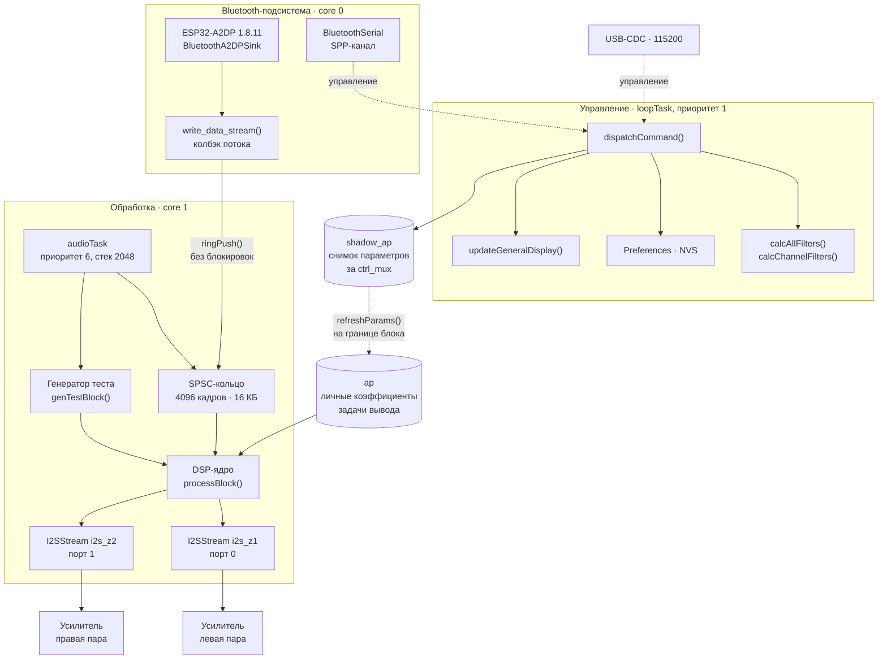
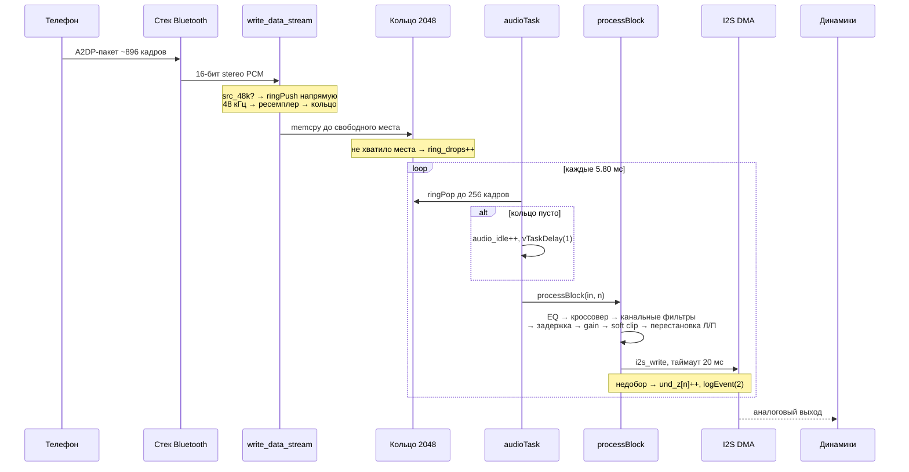
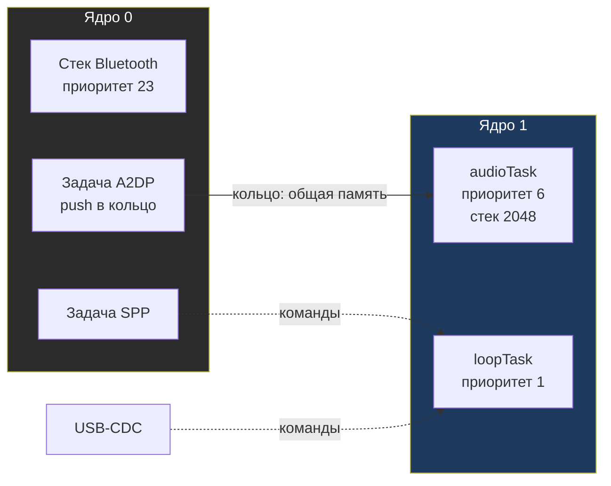

# ESP32 BiAmp — техническая документация

**Версия прошивки:** v34 · **Платформа:** ESP32-WROOM-32 (Arduino core 3.3.12) · **Лицензия:** GPLv3

Документация описывает Bluetooth A2DP-приёмник с активным двухполосным кроссовером, четырёхканальным
DSP и двухзонным усилением. Аудиопоток проходит через выделенную FreeRTOS-задачу, изолированную от
стека Bluetooth.

---

## Оглавление

- [1. Обзор проекта](#1-обзор-проекта)
  - [1.1 Назначение](#11-назначение)
  - [1.2 Возможности](#12-возможности)
  - [1.3 Спецификация тракта](#13-спецификация-тракта)
- [2. Архитектура](#2-архитектура)
  - [2.1 Схема модулей](#21-схема-модулей)
  - [2.2 Поток аудиоданных](#22-поток-аудиоданных)
  - [2.3 Распределение по ядрам и приоритетам](#23-распределение-по-ядрам-и-приоритетам)
  - [2.4 Модель владения состоянием](#24-модель-владения-состоянием)
  - [2.5 Проектные решения и их обоснование](#25-проектные-решения-и-их-обоснование)
- [3. Установка и настройка окружения](#3-установка-и-настройка-окружения)
  - [3.1 Требования](#31-требования)
  - [3.2 Установка arduino-cli](#32-установка-arduino-cli)
  - [3.3 Установка ядра ESP32 и библиотек](#33-установка-ядра-esp32-и-библиотек)
  - [3.4 Аппаратная сборка](#34-аппаратная-сборка)
  - [3.5 Сборка, прошивка и мониторинг](#35-сборка-прошивка-и-мониторинг)
- [4. Справочник API](#4-справочник-api)
  - [4.1 Командный интерфейс](#41-командный-интерфейс)
  - [4.2 Громкость и баланс](#42-громкость-и-баланс)
  - [4.3 Кроссовер и сабвуфер](#43-кроссовер-и-сабвуфер)
  - [4.4 Эквалайзер](#44-эквалайзер)
  - [4.5 Канальные фильтры, задержка и перестановка Л/П](#45-канальные-фильтры-задержка-и-перестановка-лп)
  - [4.6 Пресеты](#46-пресеты)
  - [4.7 Транспорт и диагностика](#47-транспорт-и-диагностика)
  - [4.8 Тест-сигналы](#48-тест-сигналы)
  - [4.9 Внутренний API C++](#49-внутренний-api-c)
  - [4.10 Формат сохранения NVS](#410-формат-сохранения-nvs)
- [5. Сценарии использования](#5-сценарии-использования)
  - [5.1 Первичная настройка усилителя](#51-первичная-настройка-усилителя)
  - [5.2 Развёртка динамиков](#52-развёртка-динамиков)
  - [5.3 Сведение по времени](#53-сведение-по-времени)
  - [5.4 Диагностика каналов](#54-диагностика-каналов)
  - [5.5 Типовые конфигурации](#55-типовые-конфигурации)
- [6. Диагностика и бюджет реального времени](#6-диагностика-и-бюджет-реального-времени)
  - [6.1 Счётчики `stats`](#61-счётчики-stats)
  - [6.2 Журнал событий `evlog`](#62-журнал-событий-evlog)
  - [6.3 Бюджет времени](#63-бюджет-времени)
  - [6.4 Потребление памяти](#64-потребление-памяти)
  - [6.5 Критерии здоровья системы](#65-критерии-здоровья-системы)
  - [6.6 Замер щелчка `click`](#66-замер-щелчка-click)
- [7. Troubleshooting и FAQ](#7-troubleshooting-и-faq)
  - [7.1 Проблемы подключения](#71-проблемы-подключения)
  - [7.2 Проблемы звука](#72-проблемы-звука)
  - [7.3 Проблемы сборки и прошивки](#73-проблемы-сборки-и-прошивки)
  - [7.4 FAQ](#74-faq)
- [8. Приложения](#8-приложения)
  - [8.1 Карта контактов](#81-карта-контактов)
  - [8.2 Сводка констант](#82-сводка-констант)
  - [8.3 Структура файлов](#83-структура-файлов)
  - [8.4 История изменений](#84-история-изменений)

---

## 1. Обзор проекта

### 1.1 Назначение

Устройство принимает потоковое аудио по Bluetooth A2DP, выполняет цифровую обработку в формате float32
и выводит результат на **два независимых I2S-порта** — по одному на стереопару усилительных каналов.
Каждый канал имеет собственный высокочастотный и низкочастотный фильтр, что позволяет снять
нагрузку с аналоговых кроссоверов и скомпенсировать временную развёртку динамиков.

Целевая плата — **ESP32-WROOM-32 (classic)**, ESP-IDF 5.x, Arduino core 3.3.12.

### 1.2 Возможности

| Область | Возможности |
|---|---|
| Источник | Bluetooth A2DP sink, автоматическое переподключение, AVRC-транспорт |
| Управление | Текстовый интерфейс по USB-CDC (115200) и по Bluetooth SPP |
| Кроссовер | 2- и 4-полосный (Linkwitz-Riley), частота 200–1000 Гц, сабвуфер 20–80 Гц |
| Эквалайзер | Низкие 120 Гц / средние 1 кГц / высокие 6 кГц, ±12 дБ |
| Каналы | 4 канала: НЧ и ВЧ левого и правого усилителей |
| Канальная обработка | HPF/LPF на канал (0–20 кГц), задержка 0–220 отсчётов (5 мс), перестановка выходов Л/П |
| Громкость | Независимая по зонам, 0–100 %, баланс ±10, трим НЧ/ВЧ ±(−6…+3) дБ |
| Защита | Мягкое ограничение (soft clip) с tanh-аппроксимацией, счётчики перегрузки |
| Тесты | 11 режимов тест-сигнала, включая свип и противофазный режим |
| Экран | OLED SSD1306 128×64 (I²C) |
| Хранение | NVS, версионированный блоб с автоматической миграцией со старой разметки |
| Диагностика | Счётчики потерь, андерранов, клиппинга, DSP и I2S-тайминги, кольцевой журнал событий |

### 1.3 Спецификация тракта

| Параметр | Значение |
|---|---|
| Частота вывода | 44100 Гц, фиксированная |
| Разрядность | 16 бит |
| Формат обработки | float32, нормализация `1.0f / 32768.0f` |
| Блок обработки | 256 кадров (5.80 мс) |
| Порядок каналов | `Z1`: LEFT_HF, LEFT_LF · `Z2`: RIGHT_HF, RIGHT_LF |
| Разрядка I2S | 0, 1 (по 2 канала) |
| Таймаут записи I2S | 20 мс |
| Поддержка источника | 44.1 и 48 кГц; 48 кГц понижается линейной интерполяцией до 44.1 кГц |

---

## 2. Архитектура

### 2.1 Схема модулей



### 2.2 Поток аудиоданных



### 2.3 Распределение по ядрам и приоритетам



Аудиозадача закреплена за ядром 1, чтобы вызов `i2s_write` (который может блокироваться до 20 мс)
не занимал ядро, обслуживающее Bluetooth. Кольцо — единственная точка обмена между ядрами.

### 2.4 Модель владения состоянием

Параметры пересекают границу задач через механизм снимка, а не через разделяемые изменяемые поля:


Ключевые свойства:

- **Глобальные переменные** (`vol_z`, `fc_hz`, `eq_db` и т. д.) читает и пишет только `loopTask`.
- **`shadow_ap`** — снимок рассчитанных коэффициентов, публикуется под критической секцией `ctrl_mux`.
- **`ap`** — личная копия задачи вывода. DSP работает только с ней и никогда не блокируется.
- **Состояния фильтров** (`st1`, `st2`, `chst`, `delay_buf`, `delay_idx`) принадлежат исключительно
  `audioTask` и не разделяются ни с кем.
- **`logEvent()`** пишет в кольцевой журнал под `ev_mux` — вызывается из любой задачи.

### 2.5 Проектные решения и их обоснование

| Решение | Обоснование |
|---|---|
| DSP в отдельной задаче, а не в колбэке A2DP | Колбэк A2DP исполняется внутри стека Bluetooth с высоким приоритетом. Расчёт 4 каналов × 10 секций занимает до 2.25 мс — это вызвало бы слышимые разрывы в Bluetooth-тракте |
| SPSC-кольцо вместо очереди FreeRTOS | `write()` в очередь может заблокироваться на цели A2DP. Кольцо с неблокирующим `ringPush` гарантирует, что колбэк никогда не ждёт |
| Запись кольца по частям | Блок A2DP — около 896 кадров. Запись целиком не поместилась бы в кольцо даже вдвое, поэтому `ringPush` берёт столько, сколько осталось, и считает остаток потерянным |
| `i2s_write` с таймаутом 20 мс | Ранее был `portMAX_DELAY`: при остановке источника задача вставала навсегда и глушила весь тракт |
| 4 буфера I2S по 512 байт | 8 буферов давали 23 мс упреждения на порт: задача убегала вперёд, упиралась в `i2s_write` на 19.4 мс, переставала читать кольцо, и оно переполнялось. 4 буфера дают 11.6 мс — упреждение и потери исчезают |
| Кольцо 4096 кадров (93 мс) | Поглощает единичные провалы Bluetooth-стека по 40–140 мс, не теряя кадры |
| Копирование кольца двумя частями при переносе | `ringPush` и `ringPop` выполняют два `memcpy`: хвост в `&ring_buf[idx]`, остаток в `&ring_buf[0]`. Один `memcpy` через физический конец массива выходил за границу на ~3580 байт и затирал соседние статические переменные — источник треска |
| Самотест с проверкой содержимого | Считает не только совпадение объёма, но и значения кадров: `st_active`, `st_errors`, `st_seen`, `st_bad_at` |
| Частота источника из переговоров A2DP | Раньше она оценивалась эвристикой по числу кадров и ошибалась; `set_sample_rate_callback()` даёт точное значение до первого аудиоблока |
| Сквозной самотест кольца | Проверяет связку «производитель → кольцо → задача вывода» на реальном железе при загрузке, когда A2DP ещё не подключён |
| Отложенная запись NVS на 2 с | Изменения фильтров не пишут флеш на каждый кадр; NVS изнашивается за часы и минуты |

---

## 3. Установка и настройка окружения

### 3.1 Требования

| Компонент | Требование |
|---|---|
| ОС | Windows (пути в скриптах используют `%USERPROFILE%` и `%LOCALAPPDATA%`) |
| Оболочка | PowerShell 5.1 или новее (`powershell` или `pwsh`). Скрипты используют `?.` и `Join-Path` |
| Плата | ESP32-WROOM-32 (классический, 4 МБ флеш) |
| Инструмент | `arduino-cli` 1.5.x |
| Кабель | USB с передачей данных; порт загрузки и CDC — один и тот же разъём |
| БП | 5 В, не менее 1.5 А (два канала усиления) |

### 3.2 Установка arduino-cli

```powershell
# Установка через winget
winget install ArduinoSA.CLI

# Либо вручную: https://arduino.github.io/arduino-cli/latest/installation/
```

Скрипты ожидают бинарник по пути `%USERPROFILE%\Documents\Arduino\.arduino-cli\arduino-cli.exe`.
Если он установлен иначе — измените `$Script:Cli` в `tools/common.ps1`.

Проверка и настройка каталогов Arduino:

```powershell
$cli = "$env:USERPROFILE\Documents\Arduino\.arduino-cli\arduino-cli.exe"

$cli config init
$cli config set directories.data "$env:LOCALAPPDATA\Arduino15"
$cli config set directories.user  "$env:USERPROFILE\Documents\Arduino"
$cli config get directories.data
$cli version
```

Добавьте каталог в пользовательский `PATH`, чтобы вызывать `arduino-cli` без полного пути:

```powershell
$userPath = [Environment]::GetEnvironmentVariable('Path', 'User')
[Environment]::SetEnvironmentVariable('Path', "$userPath;$env:USERPROFILE\Documents\Arduino\.arduino-cli", 'User')
```

### 3.3 Установка ядра ESP32 и библиотек

```powershell
# Ядро
$cli core update-index
$cli core install esp32:esp32            # проверено на 3.3.12

# Зависимости
$cli lib install "ESP32-A2DP"            # 1.8.11 — приёмник A2DP, I2S-драйвер
$cli lib install "audio-tools"           # 1.2.5  — I2SStream, используемый как бэкенд
$cli lib install "Adafruit_SSD1306"      # 2.5.17
$cli lib install "Adafruit_GFX_Library"  # 1.12.6

# Проверка
$cli lib list | Select-String "ESP32-A2DP|audio-tools|Adafruit"
```

> **Примечание.** Проект использует `I2SStream` из `audio-tools` (а не `ESP32A2DP` из `ESP32-A2DP`)
> для вывода, чтобы получить независимый таймаут записи через `setWaitTimeWriteMs()`.

### 3.4 Аппаратная сборка

1. Подключите I²S-драйверы к выделенным GPIO (см. [карту контактов](#81-карта-контактов)).
2. Подключите OLED по I²C: SDA → GPIO 21, SCL → GPIO 22, адрес `0x3C`, питание 3.3 В.
3. Подайте питание на усилители. **Земля ESP32 и усилителей должна быть общей** — иначе I²S-сигнал
   не будет интерпретироваться корректно.
4. Первый вход высокого уровня на любом усилителе при отсутствии сигнала даёт щелчок — начните
   с `vol:0`.

### 3.5 Сборка, прошивка и мониторинг

Все параметры (плата, порт, разметка) заданы в `tools/common.ps1`.

```powershell
# Сборка
pwsh -File .\tools\build.ps1

# Сборка + прошивка
pwsh -File .\tools\flash.ps1 -Port COM14

# Только прошивка последней сборки
pwsh -File .\tools\flash.ps1 -Port COM14 -NoBuild

# Смена разметки разделов — только с полным стиранием
pwsh -File .\tools\flash.ps1 -Port COM14 -Erase

# Мониторинг
pwsh -File .\tools\monitor.ps1 -Port COM14 -Seconds 60

# Мониторинг с отправкой команд
pwsh -File .\tools\monitor.ps1 -Port COM14 -Commands "status,stats" -Seconds 8
```

Целевая плата в `tools/common.ps1`:

```
esp32:esp32:esp32:PartitionScheme=huge_app,UploadSpeed=921600
```

`huge_app` выделяет 3 МБ под приложение — необходимо, поскольку прошивка не помещается в дефолтные
1.2 МБ. **При первой прошивке с этой разметкой обязателен `-Erase`.**

Порт также можно задать переменной окружения без правки скриптов:

```powershell
$env:BT_ESP_PORT = 'COM7'
pwsh -File .\tools\flash.ps1
```

Ожидаемый вывод загрузки:

```
boot: bi-amp v35 (lr swap instead of phase inversion)
Heap: 184716
Type 'help' for commands
NVS: blob loaded (v23)
OLED OK
I2S: z1=1 z2=1
Heap after I2S: 139912
Audio task: started
Ring selftest: PASS frames=10752/10752
Heap before BT: 137216
A2DP: started
Heap after A2DP: 56964
SPP: OK
Heap final: 50820
```

---

## 4. Справочник API

### 4.1 Командный интерфейс

Команды принимаются по двум каналам одновременно — по USB-CDC и по Bluetooth SPP. Формат:

```
<команда>[:<аргумент>]
```

Каждая строка завершается `\n` или `\r`. Буфер команды — 64 байта; более длинная строка
отбрасывается целиком, чтобы не выполнить обрезанную команду.

| Канал | Порт | Скорость | Назначение |
|---|---|---|---|
| USB-CDC | `COM14` | 115200 | основной интерфейс, полный вывод, доступен `evlog` |
| Bluetooth SPP | — | — | удалённое управление без кабеля |

> **Важно.** `evlog` печатается только через USB: SPP-клиент не получает дамп журнала,
> поскольку вывод идёт через прямой `Serial` в обход `say()`.

### 4.2 Громкость и баланс

| Команда | Диапазон | Действие | Пример |
|---|---|---|---|
| `vol:N` | 0–100 | Громкость обеих зон | `vol:40` |
| `v0:N` | 0–100 | Громкость левой зоны | `v0:55` |
| `v1:N` | 0–100 | Громкость правой зоны | `v1:45` |
| `mute:N` | 0 или 1 | Переключить mute зоны N | `mute:0` |
| `bal:N` | −10…+10 | Баланс: −10 всё влево, +10 всё вправо | `bal:2` |
| `tlf:N` | −6…+3 | Подъём НЧ, дБ | `tlf:1.5` |
| `thf:N` | −6…+3 | Срез ВЧ, дБ | `thf:-1` |

Баланс реализован через множители `bl = 1 − bal·0.03` и `br = 1 + bal·0.03`, поэтому
диапазон ±10 даёт перекос ±30 % — это подъём, а не аттенюация.

```powershell
# Типичная настройка уровня
pwsh -File .\tools\monitor.ps1 -Port COM14 -Commands "v0:45,v1:45,bal:0,tlf:1,thf:-1" -Seconds 5
```

### 4.3 Кроссовер и сабвуфер

| Команда | Диапазон | Действие | Пример |
|---|---|---|---|
| `fc:N` | 200–1000 | Частота разделения, Гц | `fc:500` |
| `hp:N` | 20–80 | Срез сабвуфера, Гц | `hp:45` |
| `sub:0\|1` | 0/1 | Выключить/включить НЧ-канал | `sub:1` |
| `xotype:1\|2` | 1/2 | 1 — Butterworth 2-го порядка, 2 — Linkwitz-Riley 4-го | `xotype:2` |
| `xo:0\|1` | 0/1 | Выключить/включить кроссовер целиком (секции 1–4) | `xo:0` |

Реализация кроссовера — секции второго порядка (biquad), каскадами:

| Секция | Назначение | Тип |
|---|---|---|
| 0 | HPF сабвуфера на `hp` | 1 (HP) |
| 1 | LPF НЧ-канала на `fc` | 0 (LP) |
| 2 | HPF НЧ-канала на `fc` | 0 (LP), только при `xotype:2` |
| 3 | HPF ВЧ-канала на `fc` | 1 (HP) |
| 4 | LPF ВЧ-канала на `fc` | 1 (HP), только при `xotype:2` |

В режиме Butterworth (`xotype:1`) секции 2 и 4 отключены (тип 5 — обход), и разрыв по фазе на
частоте раздела компенсируется настройкой задержек. В режиме LR4 оба канала симметричны по фазе,
задержки не нужны.

Команда `xo:0` переводит секции 1–4 в обход: НЧ- и ВЧ-динамики получают одинаковый тракт,
и разделение по частоте исчезает. Значения `fc` и `xotype` при этом сохраняются и применяются
сразу после `xo:1`. Сабсоник (секция 0) и полосные фильтры `chhp`/`chlp` не относятся к
кроссоверу и при `xo:0` продолжают работать — так кроссовер можно снять, не теряя подстройки
полос. Состояние выключателя показывается в строке статуса: `XO: Butter ON` или `XO: Butter OFF`.

Добавление крутизны поднимает суммарную нагрузку: 2-полосный — 4 секции на кадр,
4-полосный — 6. Измеренное время DSP растёт примерно с 1.6 мс до 2.25 мс на блок.

### 4.4 Эквалайзер

| Команда | Диапазон | Полоса | Тип фильтра | Пример |
|---|---|---|---|---|
| `eql:N` | −12…+12 | 120 Гц, Q = 0.707 | Пик (колокол) | `eql:2` |
| `eqm:N` | −12…+12 | 1000 Гц, Q = 1.0 | Полка низких | `eqm:-1.5` |
| `eqh:N` | −12…+12 | 6000 Гц, Q = 0.707 | Полка высоких | `eqh:1` |

Полосы с усилением менее 0.05 дБ физически отключаются (тип 5 — обход), чтобы не тратить время DSP
впустую. Для полного сброса удобнее `preset:0`.

### 4.5 Канальные фильтры, задержка и перестановка Л/П

| Команда | Диапазон | Действие | Пример |
|---|---|---|---|
| `chhp:C:F` | C = 0–3, F = 0–20000 | Фильтр верхних частот на канале C | `chhp:0:80` |
| `chlp:C:F` | C = 0–3, F = 0–20000 | Фильтр нижних частот на канале C | `chlp:0:10000` |
| `delayC:N` | C = 0–3, N = 0–220 | Задержка канала C в отсчётах | `delay2:3` |
| `swap:N` | N = 0–1 | Переставить выходы Л/П: 1 — каналы 0,1 в правый разъём, 2,3 — в левый | `swap:1` |

> **Перестановка Л/П вместо инверсии фазы.** В v35 инверсии фазы больше нет:
> команда `inv:` убрана вместе с полем `INV:` в `status`. Её место заняла
> перестановка каналов `swap:` и строка `SWP: 0|1`. Перестановка меняет
> стороны, а не знак сигнала, поэтому левый канал слышно в левом динамике.
> Прежнее значение `INV:` из блоба v22 при миграции не переносится: это
> была другая настройка, и `swap` после обновления всегда 0.

> **Обратите внимание на разные схемы аргументов.** У `chhp`/`chlp` канал отделён двоеточием
> (`chhp:0:80`), а у `delay` — приписан к имени команды (`delay2:3`). Формы `chhp0:80` парсер
> **не принимает** и молча игнорирует. Это проверено на устройстве: после `chhp:0:80` в `status`
> появляется `CHF: 80/0`, а после `chhp0:80` значение не меняется.

**Нумерация каналов:**

| Индекс | Назначение | Порт I2S | Зона |
|---|---|---|---|
| 0 | LEFT — низ (НЧ) | `i2s_z1`, левый | 0 (левая) |
| 1 | LEFT — верх (ВЧ) | `i2s_z1`, правый | 0 (левая) |
| 2 | RIGHT — низ (НЧ) | `i2s_z2`, левый | 1 (правая) |
| 3 | RIGHT — верх (ВЧ) | `i2s_z2`, правый | 1 (правая) |

Значения `ch_hp`/`ch_lp` в диапазоне 0–19 Гц поднимаются до 20 Гц; значение 0 отключает фильтр.

> **Особенность.** При изменении длительности задержки линия задержки обнуляется. Иначе скачок
> сдвинул бы фазу и выбросил в выход до 11 мс старого аудио. Короткое затухание приемлемее щелчка.

### 4.6 Пресеты

| Команда | `fc` | `tlf` | `thf` | `eql` | `eqm` | `eqh` |
|---|---|---|---|---|---|---|
| `preset:0` | 400 | 0 | −1 | 0 | 0 | 0 |
| `preset:1` | 500 | −2 | +1 | 0 | +2 | 0 |
| `preset:2` | 400 | −4 | −2 | 0 | 0 | 0 |
| `preset:3` | 350 | +3 | 0 | +2 | 0 | +1 |

Пресет меняет кроссовер, сабвуфер, тримы и эквалайзер, но **не трогает** громкость, баланс,
канальные фильтры, задержки и перестановку Л/П.

### 4.7 Транспорт и диагностика

| Команда | Действие |
|---|---|
| `play` | AVRCP-команда «воспроизвести» (требует подключённого AVRC) |
| `pause` | AVRCP-команда «пауза» |
| `next` | Следующий трек |
| `prev` | Предыдущий трек |
| `status` | Текущие параметры (11 строк) |
| `stats` | Счётчики тракта (8 строк) |
| `click` | Замер щелчка на границах потока (5 строк) |
| `evlog` | Дамп кольцевого журнала событий |
| `heap` | Текущий объём свободной кучи |
| `save` | Немедленно записать параметры в NVS |
| `reboot` | Перезагрузка |
| `factory` | Очистка NVS и перезагрузка к заводским настройкам |
| `help` | Краткая справка по синтаксису |

Команды транспорта вызывают методы `a2dp_sink` только при `is_avrc_connected()`. Без активного
AVRC-соединения они молча игнорируются — это защищает от зависания на неподдерживаемом стеке.

### 4.8 Тест-сигналы

| Команда | Режим | Каналы | Описание |
|---|---|---|---|
| `test:off` | 0 | — | Выключить тест, вернуться к Bluetooth |
| `test:all` | 1 | 0,1,2,3 | Тон на всех каналах |
| `test:l` | 2 | 0,1 | Левая зона |
| `test:r` | 3 | 2,3 | Правая зона |
| `test:woof` | 4 | 0,2 | Оба низкочастотных канала |
| `test:tweet` | 5 | 1,3 | Оба высокочастотных канала |
| `test:1` … `test:4` | 6–9 | один | Отдельный канал |
| `test:anti` | 10 | 0,1,2,3 | Тон с инверсией правого канала в каждой паре |
| `test:sweep` | 11 | 0,1,2,3 | Свип 20 Гц → 20 кГц |

| Команда | Диапазон | Действие |
|---|---|---|
| `tf:N` | 20–20000 | Частота тона, Гц |
| `tvol:N` | 0–100 | Громкость теста (по умолчанию 6 %) |

Тест-сигнал проходит **полный тракт**: EQ, кроссовер, канальные фильтры, задержку,
перестановку Л/П и soft clip. Громкость теста управляется отдельно от громкостей зон и не зависит от `mute`.

> **Режим `test:anti`** в правом канале пары даёт противофазный сигнал. Если динамики включены
> последовательно, разница времённой развёртки складывается — в моменты пересечения фаз слышен
> провал. Это основной инструмент настройки.

```powershell
# Свип для проверки развёртки
pwsh -File .\tools\monitor.ps1 -Port COM14 -Commands "test:sweep,status" -Seconds 8
```

### 4.9 Внутренний API C++

Ниже — точки расширения для изменения прошивки. Все функции находятся в `BT_esp.ino`.

#### Расчёт фильтров

```cpp
// Расчёт одной секции второго порядка.
// type: 0 = LPF, 1 = HPF, 2 = полка низких, 3 = пик, 4 = полка высоких, 5 = обход.
// Записывает нормированные коэффициенты b0..b2 и a1..a2.
void calcSectionTo(float out_cb[][3], float out_ca[][2],
                   uint8_t sec, uint8_t type, float f, float q, float db);
```

```cpp
// Пересчёт всех коэффициентов: 8 глобальных секций + 2 секции на каждый из 4 каналов.
void calcAllFilters(AudioParams &p);
void calcChannelFilters(AudioParams &p);
```

#### Публикация параметров

```cpp
// Единственная точка публикации. Вызывается из loopTask.
// Пересчитывает коэффициенты и копирует снимок в shadow_ap под ctrl_mux.
void scheduleFilterUpdate();
```

```cpp
// Вызывается в audioTask на границе блока.
// Применяет снимок, если ap_dirty установлен, и обнуляет линию задержки
// при изменении её длительности.
void refreshParams();
```

#### DSP-ядро

```cpp
// Обрабатывает n кадров стерео и пишет результат в оба I2S-порта.
// Цепочка: EQ → кроссовер → канальные фильтры → задержка → gain → soft clip → перестановка Л/П.
void processBlock(const int16_t *in, int n);
```

```cpp
// Одна секция второго порядка в форме Direct Form II (транспонированной).
inline float runSec(float x, uint8_t s, uint8_t sec);

// Две секции канального фильтра (HPF + LPF) последовательно.
inline float runCh(float x, uint8_t c);

// Линия задержки длиной DELAY_BUF_SIZE отсчётов с кольцевым индексом.
inline float applyDelay(float x, uint8_t ch, uint16_t delay_samples);

// Аппроксимация tanh; ограничивает результат диапазоном [-1, 1].
inline float fast_tanh(float x);

// Мягкое ограничение: линейно до 0.8, далее сжатие через fast_tanh.
inline float softClip(float x, uint8_t ch);
```

#### Кольцевой буфер

```cpp
// Производитель (задача A2DP). Никогда не блокирует.
// При переносе через конец копирует ДВЯМЯ частями:
//   memcpy(&ring_buf[idx], ...) и memcpy(&ring_buf[0], ...)
// Один memcpy через физический конец выходит за границу массива.
// При нехватке места пишет доступное, остальное считает потерянным в ring_drops.
static void ringPush(const int16_t *frm, int n);

// Потребитель (audioTask). Возвращает фактическое число скопированных кадров.
// Тоже копирует двумя частями при переносе через конец.
static int ringPop(int16_t *dst, int maxn);

// Сброс содержимого — выполняется при включении тест-режима.
static void ringFlush();

// Текущая заполненность в кадрах.
static uint32_t ringLevel();

// Сквозной самотест: 12 блоков по 896 кадров (10 752 кадра, 2.5 оборота кольца).
// Проверяет не только объём, но и значения кадров: счётчик bad_frames и позиция
// первого повреждённого кадра st_bad_at.
// Вызывается из setup() до старта A2DP, поэтому единственный производитель — сам тест.
static bool ringSelfTest();
```

#### Приём потока

```cpp
// Колбэк A2DP: 16-бит stereo PCM.
// Для 44.1 кГц — прямая запись в кольцо. Для 48 кГц — линейная интерполяция
// с шагом RATIO48 (48000/44100) до 44.1 кГц, результат кладётся в кольцо частями
// по BLOCK_FRAMES кадров.
void write_data_stream(const uint8_t *data, uint32_t length);
```

```cpp
// Частота источника из переговоров A2DP: rate > 46000 → 48 кГц.
void on_sample_rate(uint16_t rate);

// Состояние соединения и воспроизведения.
void bt_state_cb(esp_a2d_connection_state_t state, void *);
void audio_state_cb(esp_a2d_audio_state_t state, void *);
```

#### Команды и хранилище

```cpp
// Разбор и выполнение одной команды. Вызывается из loopTask для USB и SPP.
void dispatchCommand(const char *cmd);

// Чтение строки из потока; возвращает указатель на буфер при наличии завершённой строки.
const char *pollLine(Stream &s, char *buf, uint8_t &len, bool &skip);

// Разбор значения с проверкой диапазона: возвращает false на мусоре и NaN/Inf.
static bool parseFloat(const char *s, float &out, float min, float max);

// Запись всех параметров в NVS одним блобом и проверка результата.
void saveAllParams();

// Приведение параметров к допустимым пределам; вызывается после загрузки из NVS.
void sanitizeParams();
```

#### Журнал событий

```cpp
// Атомарная запись в кольцевой журнал из любой задачи.
void logEvent(uint8_t type, uint16_t val);

// Снимок журнала под ev_mux с последующей печатью через Serial.
void dumpEventLog();
```

### 4.10 Формат сохранения NVS

Имя пространства имён — `biampv12`, ключ — `blob`. Данные хранятся одной упакованной структурой
`PBlob` с полем `version` (текущее значение — 21).

```cpp
struct PBlob {
  uint32_t version;
  float v0, v1, fc, hp, tlf, thf, eq0, eq1, eq2, bal, tvol;
  float chh[4], chl[4];
  uint16_t dly[4];
  uint8_t m0, m1, sub, xot, swp, xoon;
} __attribute__((packed));
```

Порядок загрузки при старте:

1. Читается `blob`. Если длина совпала и `version == 21` — применяются сохранённые значения.
2. Иначе выполняется чтение старой разметки (отдельные ключи `v0`, `m0`, `fc`, `c0h` и т. д.),
   значения нормализуются `sanitizeParams()` и сразу записываются обратно уже в формате v21.
3. Если блоба нет вовсе — применяются заводские значения, они же записываются в NVS.

Любое изменение параметров ставит флаг `paramsDirty`; запись выполняется в `loop()` через
2 секунды без изменений либо немедленно по команде `save`.

---

## 5. Сценарии использования

### 5.1 Первичная настройка усилителя

```powershell
pwsh -File .\tools\monitor.ps1 -Port COM14 -Commands "vol:0,preset:0,fc:400,hp:45,sub:1,xotype:1" -Seconds 5
```

Далее по порядку:

1. `test:all`, `tvol:20` — убедиться, что молчат все четыре канала.
2. `test:1` — низ левый: отрегулировать усиление до нужного уровня.
3. `test:2` — верх левый: выровнять громкость с каналом 1.
4. `test:3`, `test:4` — правая пара, выровнять по левой.
5. `v0:N`, `v1:N` — итоговые громкости зон.
6. `test:off`, `save`.

### 5.2 Развёртка динамиков

Порядок принципиален: сначала временная, потом фазовая.

```powershell
# 1. Убрать асимметрию пассивных фильтров
pwsh -File .\tools\monitor.ps1 -Port COM14 -Commands "preset:0,xotype:1,swap:0" -Seconds 5

# 2. Выставить противофазный тон на одной паре и найти момент провала
pwsh -File .\tools\monitor.ps1 -Port COM14 -Commands "test:l,test:anti,tf:200,tvol:30" -Seconds 10

# 3. Подбирать задержку ВЧ-канала, пока провал не перестанет быть слышимым
pwsh -File .\tools\monitor.ps1 -Port COM14 -Commands "delay1:1" -Seconds 4
pwsh -File .\tools\monitor.ps1 -Port COM14 -Commands "delay1:2" -Seconds 4
# ... и так далее до 220 отсчётов (5 мс)

# 4. Проверить результат и повторить для правой пары
pwsh -File .\tools\monitor.ps1 -Port COM14 -Commands "test:r,test:anti,delay3:2" -Seconds 8
```

Один отсчёт на 44.1 кГц — 22.7 мкс. Диапазон 0–220 покрывает до 5 мс, что перекрывает типовую
разницу времённой развёртки 4-дюймового мидбаса и 1-дюймового твитера.

### 5.3 Сведение по времени

Если развёртка выровнена, но нужна дополнительная задержка между зонами для выравнивания
акустических центров:

```powershell
# Правая зона отстаёт на 1.5 мс — задержать каналы 2 и 3 (66 отсчёков)
pwsh -File .\tools\monitor.ps1 -Port COM14 -Commands "delay2:66,delay3:66" -Seconds 5
```

Важно: задержка на каналах НЧ-зоны **сдвигает** весь тракт этой зоны, поэтому после применения
проверьте кроссовер — `test:woof` и `test:tweet` должны звучать согласованно.

### 5.4 Диагностика каналов

| Симптом | Команды | Интерпретация |
|---|---|---|
| Тишина на канале | `test:C` | Молчит только этот канал — проблема усилителя или проводки, DSP исправен |
| Щелчок при включении | `swap:0`, `test:anti` | Проверка последовательного включения |
| Периодический «бульк» | `stats` | Смотрите `Underrun` и `RingDrops` — это потери, а не артефакт усилителя |
| «Пластмассовый» звук | `fc` | Частота раздела слишком низкая: уменьшите `fc` |
| Провал в середине | `test:anti`, `eqm:0` | Проверьте, не лезет ли полка 1 кГц в зону раздела |
| Перегрузка | `stats` → `Clips` | Ненулевые значения — убавьте громкость или `tlf` |

### 5.5 Типовые конфигурации

**Двухполосный активный, штатная настройка**

```
vol:40, preset:0, fc:400, hp:45, sub:1, xotype:1, delay1:2, delay3:2
```

**Четырёхполосный Linkwitz-Riley, задержки не требуются**

```
vol:40, fc:500, hp:50, sub:1, xotype:2, swap:0, delay1:0, delay3:0
```

**Профессиональный твитер, срез ВЧ приподнят**

```
vol:35, tlf:-1, thf:1.5, eqh:1, eql:1, eqm:0
```

**Диагностический режим с тихим фоном**

```
vol:0, test:sweep, tf:1000, tvol:5
```

**Работа в поле, частые переключения**

```
vol:50, preset:1, v0:50, v1:50, bal:0
```

---

## 6. Диагностика и бюджет реального времени

### 6.1 Счётчики `stats`

| Строка | Поле | Значение |
|---|---|---|
| `Frames` | `g_in_frames` | Кадров, принятых колбэком A2DP с момента загрузки |
| `Blocks` | `audio_blocks` | Блоков, обработанных задачей вывода |
| `AF` | `audio_frames` | Кадров, реально пропущенных через DSP |
| `Idle` | `audio_idle` | Итераций, где кольцо оказалось пустым |
| `Underrun Z1/Z2` | `und_z[0..1]` | Недоборов записи в I2S (неполная передача) |
| `RingDrops` | `ring_drops` | Кадров, потерянных из-за нехватки места в кольце |
| `BadSamples` | `bad_samples` | Кадров, дошедших до DSP с неверным содержимым — прямой признак порчи кольца |
| `Clips` | `clip_cnt[0..3]` | Срабатываний soft clip по каждому каналу |
| `Starve n/max` | `starve_cnt`, `starve_max_ms` | Провалов между пакетами A2DP длиннее 80 мс |
| `DSP max` | `dsp_max_us` | Максимальное время обработки блока |
| `WR max` | `wr_max_us` | Максимальное время записи в I2S |
| `Loop max` | `loop_max_ms` | Максимальный интервал между итерациями `loop()` |
| `NVS max` | `nvs_max_ms` | Максимальное время записи в NVS |
| `HeapMin` | — | Минимум свободной кучи с момента загрузки |

> **Важно.** `und_z` и `clip_cnt` обнуляются каждые 5 секунд housekeeping-циклом при выводе
> строки `WARN`. Остальные счётчики накапливаются с момента загрузки. Строка `WARN` печатается
> только при ненулевых значениях, поэтому в норме вывода нет вовсе.

**Как читать:**

- `RingDrops: 0` при `Frames > 0` — тракт не теряет аудио. Это главный показатель здоровья.
- `BadSamples: 0` — данные в кольце не портятся. Ненулевое значение означает повреждение памяти
  при копировании (в v25–v28 — переполнение `ring_buf` при переносе, источник треска).
- `AF` должен совпадать с `Frames` плюс 5376 кадров самотеста.
- Высокий `Idle` при нулевых `RingDrops` — норма: A2DP приходит пакетами, кольцо между пакетами пусто.
- `DSP max` выше 5500 мкс означает риск: бюджет блока при 44.1 кГц равен 5800 мкс.
- `WR max` выше 20000 мкс означает срабатывание таймаута записи.

### 6.2 Журнал событий `evlog`

Кольцевой буфер на 16 записей. Каждая содержит метку времени, тип и значение.

| Тип | Событие | Значение |
|---|---|---|
| 1 | Провал между пакетами A2DP | Интервал, мс |
| 2 | Недобор записи в I2S | 0 — порт Z1, 1 — порт Z2 |
| 3 | Медленная запись NVS | Длительность, мс |
| 4 | Смена частоты источника | 44 или 48 |
| 5 | Потеря кадров в кольце | Число потерянных кадров |
| 6 | Застой главного цикла | Интервал, мс |
| 7 | Сброс состояния DSP на старте потока | 0 |
| 8 | Гашение выхода на остановке потока | Кадров гашения |

```
24531 t=4 v=44
30118 t=1 v=63
58320 t=6 v=138
```

Журнал обнуляется при каждой перезагрузке. Он полезен при разборе rare-событий: щелчок в
динамике почти всегда сопровождается записями типов 1, 5 или 6.

Пара событий 7 и 8 — границы потока: 7 означает сброс состояния DSP на старте, 8 — гашение
выхода на остановке. Если между двумя событиями 8 подряд проходит много времени, поток
перезапускался: телефон убирает A2DP на паузу и возвращает при возобновлении.

### 6.3 Бюджет времени

При частоте 44.1 кГц и блоке в 256 кадров один блок должен быть обработан за **5800 мкс**.

| Этап | Бюджет | Измерено | Запас |
|---|---|---|---|
| DSP, 2-полосный | 5800 мкс | ~1.6 мс | 72 % |
| DSP, 4-полосный | 5800 мкс | ~2.25 мс | 61 % |
| Запись в I2S (2 порта) | — | 8.4 мкс макс. | — |
| Период DMA-буфера I2S | 2900 мкс | — | — |
| Запас DMA (4 буфера) | 11 600 мкс | — | — |
| Ёмкость кольца | 92 900 мкс | — | — |
| Размер пакета A2DP | 20 300 мкс | — | — |

> **Критично:** телефон отдаёт поток пакетами неравномерно — замеры показывают интервалы между
> пакетами A2DP до **80 мс** при норме 20 мс. Кольцо обязано перекрывать худший интервал, иначе
> на всплесках кадры теряются, а в паузах DMA останавливается. При `RING_FRAMES 2048` (46 мс)
> разрывы пробивали буфер с обеих сторон. В v26 кольцо увеличено до 4096 кадров (93 мс), чего
> достаточно для наблюдавшихся 80 мс. Проверять надо не только `RingDrops`, но и `Starve max`:
> он показывает худший разрыв, и кольцо должно быть больше этого значения.

### 6.4 Потребление памяти

Статические буферы (не считая стека FreeRTOS):

| Объект | Размер | Комментарий |
|---|---|---|
| `ring_buf` | 16384 Б | 4096 кадров × 2 канала × 2 байта |
| `delay_buf` | 4096 Б | 4 канала × 256 отсчётов × float |
| `bz1`, `bz2`, `inbuf` | 3072 Б | По 1024 байта |
| `obuf` в колбэке | 1024 Б | Промежуточный буфер ресемплера |
| `shadow_ap` + `ap` | ~700 Б | Два снимка `AudioParams` |
| `evbuf` | 128 Б | Журнал на 16 записей |
| Стек `audioTask` | 2048 Б | Выделен FreeRTOS |
| DMA-буферы I2S | 4096 Б | 2 порта × 4 × 512 |
| **Итого** | **~23.4 КБ** | |

Наблюдаемая динамика кучи при загрузке:

| Этап | Свободно |
|---|---|
| После старта | 197 496 |
| После I2S и OLED | 139 912 |
| Перед A2DP | 137 216 |
| После A2DP | 56 964 |
| Финал | 50 820 |
| Минимум при воспроизведении | ~24 400 |

Минимум в 24 КБ означает комфортный запас для аллокаций стека Bluetooth. Значение ниже 8 КБ
считается опасным: в сочетании с фрагментацией кучи стек Bluedroid способен упасть с паникой.

### 6.5 Критерии здоровья системы

Проверка после любой прошивки и после изменения констант аудиотракта:

```powershell
# 1. Самотест прошёл при загрузке
#    Ring selftest: PASS frames=10752/10752

# 2. Запустить воспроизведение и снять статистику
pwsh -File .\tools\monitor.ps1 -Port COM14 -Commands "play" -Seconds 40
pwsh -File .\tools\monitor.ps1 -Port COM14 -Commands "stats" -Seconds 6
```

| Показатель | Норма | Тревога |
|---|---|---|
| `RingDrops` | 0 | > 0 — растёт со временем |
| `Underrun` | 0 | > 0 — DMA недобирает |
| `Clips` | 0 при разумной громкости | растёт вместе с громкостью |
| `DSP max` | < 3000 мкс | > 5500 мкс |
| `WR max` | < 10000 мкс | > 20000 мкс |
| `HeapMin` | > 20000 | < 8000 |

---

## 7. Troubleshooting и FAQ

### 7.1 Проблемы подключения

**Телефон не находит устройство**

1. `status` → строка `BT:` должна показывать `ON`. Если `OFF` — A2DP не стартовал.
2. Проверьте лог загрузки: должна быть строка `A2DP: started`. Её отсутствие означает
   нехватку памяти — сопоставьте с `Heap before BT` в логе.
3. Убедитесь, что устройство не подключено к другому телефону: A2DP-сервер занимает одно соединение.
4. `reboot` и повторите поиск. Имя устройства — `ESP32 BiAmp Speaker`.

**Подключается, но звука нет**

- `play` через AVRC не сработает, если нет активного AVRC-соединения. Проверьте, что телефон
  показывает экран плеера, а не только экран выбора устройства.
- `test:all` — если тон идёт, проблема в источнике, а не в тракте.
- `status` → `Src:` должен совпадать с тем, что реально шлёт телефон. При `48 kHz` убедитесь,
  что ресемплер активен: строка `Sample rate: 48 kHz` печатается в лог при смене.

**SPP недоступен, USB работает**

- SPP и A2DP используют одно имя `ESP32 BiAmp Speaker`. Некоторые телефоны поднимают только
  одно из профилей. Для SPP используйте отдельное приложение-терминал, а не плеер.
- Проверьте `status` → `SPP: ON`.

### 7.2 Проблемы звука

**Периодические щелчки или «бульканье»**

```powershell
pwsh -File .\tools\monitor.ps1 -Port COM14 -Commands "stats" -Seconds 6
```

| Что видно | Причина | Что делать |
|---|---|---|
| `RingDrops` растёт | Задача вывода не успевает, кольцо переполняется | Увеличить `BLOCK_FRAMES` обратно к 256 и убедиться, что `RING_FRAMES` = 4096 |
| `BadSamples` ненулевое | Данные в кольце портятся при копировании — в v25–v28 переполнение `ring_buf` при переносе | Исправить `ringPush`/`ringPop` на копирование двумя частями (исправлено в v29) |
| `Underrun` растёт | Не хватает данных к моменту DMA | Увеличить `BT_ESP_I2S_BUFFERS` до 6 |
| Оба нулевые | Потери нет | Проблема вне прошивки: проводка, питание, заземление |

**Искажения при высокой громкости**

- `stats` → `Clips` ненулевые: soft clip работает, сигнал перегружает тракт. Убавьте `vol`.
- `DSP max` близко к 5500 мкс: снизьте нагрузку — `xotype:1` вместо `xotype:2`,
  уберите лишние канальные фильтры, обнулите полки EQ.

**Один канал тише другого**

- `v0` и `v1` различны — сравните `status`.
- Разная задержка: `status` → `Delay: ...` должен показывать одинаковые значения для каналов
  одной зоны при настройке развёртки.
- `swap:1` мог остаться включённым: `status` → `SWP: 1`.

**Звук начинается с щелчка**

- Кольцо содержит остатки предыдущего трека. При смене трека это нормально.
- `test:off` сбрасывает кольцо принудительно, если проблема мешает диагностике.

**Нет звука после изменения настроек**

- Проверьте, не включён ли `test` в ненулевой режим: `status` → `Test: 0` обязательно.
- `mute:0` и `mute:1` переключают mute; итог отображается на OLED как `MUTED`.

### 7.3 Проблемы сборки и прошивки

**`arduino-cli не найден`**

Путь берётся из `tools/common.ps1`:
`%USERPROFILE%\Documents\Arduino\.arduino-cli\arduino-cli.exe`. Исправьте `$Script:Cli`
либо перенесите бинарник.

**`Сборка провалилась (код 1)`**

Смотрите первую строку с `error:` в выводе. Типичные причины:

| Ошибка | Причина |
|---|---|
| `'audio_blocks' was not declared in this scope` | Счётчик объявлен ниже по файлу, чем использование |
| `I2SDriverESP32V1` не найден | Устаревшая `audio-tools`; нужна 1.2.x |
| Не хватает `AudioTools.h` | Библиотека не установлена или не в `documents\Arduino\libraries` |

**`Прошивка провалилась` или плата не перезагружается**

- Проверьте, что порт не занят: закройте Arduino IDE, Serial Monitor, любой терминал.
- Зажмите `BOOT`, нажмите `EN`, отпустите `BOOT`.
- `-Port` должен совпадать с выводом `arduino-cli board list`.

**После смены разметки разделов устройство не грузится**

Обязательна первая прошивка с полным стиранием:

```powershell
pwsh -File .\tools\flash.ps1 -Port COM14 -Erase
```

**Настройки сбросились**

- Версия блоба не 21 — в лог пишется `NVS: legacy migrated to v21`, это штатная миграция.
- `factory` очищает всё и перезагружает с заводскими значениями.
- Проверьте, что параметры дождались записи: `save` или подождите 2 секунды без изменений.
  `NVS max` в `stats` покажет, была ли запись.

### 7.4 FAQ

**Почему частота вывода фиксирована 44.1 кГц?**

I2S настроен один раз при загрузке. Источник 48 кГц понижается ресемплером до 44.1 кГц
(`RATIO48 = 48000/44100`, линейная интерполяция). Это избавляет от перенастройки DMA на лету.
Потери качества на линейной интерполяции в верхней части диапазона минимальны для потока
с кодеком SBC, который и так ограничен.

**Почему не используется ESP32A2DP из библиотеки ESP32-A2DP?**

Нужен независимый таймаут записи в I2S. `I2SStream` из `audio-tools` предоставляет
`setWaitTimeWriteMs()` напрямую, тогда как `ESP32A2DP` скрывает драйвер.

**Почему задача вывода закреплена за ядром 1?**

Вызов `i2s_write` может блокироваться до 20 мс. На ядре 0 это остановило бы задачу A2DP
и Bluetooth-стек, что дало бы разрывы длиной десятки миллисекунд.

**Что произойдёт при выборе нового трека?**

Кольцо не очищается, поэтому первые до 93 мс нового трека смешаны с хвостом предыдущего.
Это физически неизбежно при переменном битрейте и не воспринимается на слух.

**Можно ли увеличить `RING_FRAMES` до 8192?**

Сейчас уже 4096 (16 КБ статической памяти), и этого достаточно: наблюдавшийся худший разрыв
потока — 80 мс, ёмкость кольца 93 мс. Дальнейшее увеличение съедает запас кучи для Bluetooth-стека
(`HeapMin` сейчас ~15.8 КБ). Меняйте только вместе с проверкой `HeapMin` из `stats`.

**Почему `ringPush` и `ringPop` копируют двумя частями?**

`ring_buf` — обычный линейный массив, а не кольцо на указателях. Один `memcpy` от позиции
`ring_w & RING_MASK` физически продолжался бы за концом массива. Пока блок A2DP (≈896 кадров)
помещался в кольцо дважды, хвост успевал затираться началом и повреждение оставалось незаметным
для счётчиков объёма. При `RING_FRAMES = 4096` и `SELFTEST_CHUNK = 896` запись стартовала с
индекса 8190 при размере массива 8192 элементов — выход за границу ~3580 байт, затиравший
соседние статические переменные. Отсюда треск на смартфоне при нулевых `RingDrops` и `Underrun`
и чистый звук внутреннего генератора, который кольцо не использует.

**Почему `stats` показывает `Frames: 0`, когда музыка играет?**

Счётчик накапливается с момента загрузки. Если он равен нулю, значит с перезагрузки не было ни
одного пакета A2DP. Проверьте, что `play` действительно запускает воспроизведение, а не просто
переключает паузу на телефоне.

**Как переключить порт для другой платы (ESP32-S3)?**

В `tools/common.ps1` замените FQBN на `esp32:esp32:esp32s3:PartitionScheme=huge_app,...`
и проверьте распиновку в [карте контактов](#81-карта-контактов) — у S3 выводы 26/27 заняты
флеш-памятью.

---

## 8. Приложения

### 8.1 Карта контактов

| Сигнал | GPIO | Назначение |
|---|---|---|
| `Z1_BCK` | 4 | I²S бит-клок порта 0 |
| `Z1_LCK` | 15 | I²S выбор канала (LR clock) порта 0 |
| `Z1_DIN` | 2 | I²S данные порта 0 → левый усилитель |
| `Z2_BCK` | 26 | I²S бит-клок порта 1 |
| `Z2_LCK` | 25 | I²S выбор канала порта 1 |
| `Z2_DIN` | 27 | I²S данные порта 1 → правый усилитель |
| `OLED_SDA` | 21 | I²C данные, I²C 400 кГц |
| `OLED_SCL` | 22 | I²C такт |
| — | 0/1 | UART для загрузки и CDC |
| — | 3, 32, 33 | Светодиоды (свободны) |

Распределение по портам I2S:

```
i2s_z1 (порт 0) → левый усилитель
   канал 0 (левый  выход) = НЧ-канал 0
   канал 1 (правый выход) = ВЧ-канал 1

i2s_z2 (порт 1) → правый усилитель
   канал 0 (левый  выход) = НЧ-канал 2
   канал 1 (правый выход) = ВЧ-канал 3
```

### 8.2 Сводка констант

| Константа | Значение | Назначение |
|---|---|---|
| `SAMPLE_RATE` | 44100 | Частота вывода I2S и расчёта фильтров |
| `BITS_PER_SAMPLE` | 16 | Разрядность I2S |
| `RAMP_K` | 0.001 | Коэффициент сглаживания громкости на отсчёт |
| `RATIO48` | 48000/44100 | Шаг ресемплера 48 → 44.1 кГц |
| `NVS_NS` | `biampv12` | Пространство имён NVS |
| `NVS_SAVE_DELAY` | 2000 | Задержка автосохранения, мс |
| `DEVICE_NAME` | `ESP32 BiAmp Speaker` | Имя A2DP и SPP |
| `DELAY_BUF_SIZE` | 256 | Длина линии задержки, отсчётов |
| `MAX_DELAY_SAMPLES` | 220 | Максимальная задержка (5 мс) |
| `BLOCK_FRAMES` | 256 | Кадров на блок обработки (5.80 мс) |
| `RING_FRAMES` | 4096 | Ёмкость кольца (92.9 мс) — перекрывает разрывы потока до 80 мс |
| `BT_ESP_I2S_BUFFERS` | 4 | Буферов DMA на порт (11.6 мс). 8 буферов стоят ~22 КБ кучи сверху |
| `I2S_WRITE_TIMEOUT_MS` | 20 | Таймаут `i2s_write` |
| `AUDIO_TASK_STACK` | 2048 | Стек задачи вывода |
| `AUDIO_TASK_PRIO` | 6 | Приоритет задачи вывода |
| `AUDIO_TASK_CORE` | 1 | Ядро задачи вывода |
| `SELFTEST_CHUNK` | 896 | Кадров в одном блоке самотеста (размер блока A2DP) |
| Версия блоба NVS | 21 | Формат `PBlob` |

### 8.3 Структура файлов

```
D:\BT_esp\
├── BT_esp.ino          # Весь скетч: 1021 строка, единственный исходный файл
├── DOCUMENTATION.md    # Настоящий документ
├── .gitignore          # Исключает .build и временные файлы
├── .build\             # Артефакты сборки (создаётся автоматически)
└── tools\
    ├── common.ps1      # Общие настройки: FQBN, порт, пути, функции
    ├── build.ps1       # Компиляция
    ├── flash.ps1       # Сборка + прошивка, поддержка -NoBuild и -Erase
    └── monitor.ps1     # Мониторинг порта и отправка команд
```

Карта исходника по строкам:

| Диапазон | Содержимое |
|---|---|
| 1–20 | Заголовок с перечнем проектных решений |
| 21–74 | Константы, пины, параметры компиляции |
| 76–141 | Глобальные переменные, снимок `AudioParams`, состояние DSP |
| 142–174 | Журнал событий |
| 176–258 | Расчёт фильтров и публикация снимка |
| 260–392 | DSP-ядро: секции, задержка, soft clip, `processBlock` |
| 394–490 | Генератор теста, SPSC-кольцо, самотест |
| 492–514 | Задача вывода |
| 516–584 | Колбэк A2DP, ресемплер, колбэки состояния |
| 595–650 | NVS: структура, сохранение, санитация, пресеты |
| 652–867 | Разбор и выполнение команд, обработка потоков |
| 869–889 | OLED |
| 891–1019 | `setup()` и `loop()` |

### 8.4 История изменений

| Версия | Изменения |
|---|---|
| **v34** | **Щелчок на границах потока измерен прибором: команда `click` меряет размах выхода в первых 256 кадрах после старта и в последнем блоке после гашения. Контрольный прогон с отключённым сбросом (`CLICK_PROBE_SELFTEST`) дал `Start max 1985` при уровне сигнала 168 — 1181% от сигнала; с фиксом `Start 0`, `Fade end 0`. Обычные счётчики щелчок не видят: данные не теряются, неверно только начало отсчёта** |
| **v33** | **Счётчик `Starve` приведён к реальным потерям. Порог зазора между пакетами A2DP поднят с 40 до 80 мс: 40 мс ниже межпакетного интервала, телефон шлёт аудио пачками с зазором 41–53 мс, и счётчик врал (`n=184`, `max=3019` мс при нулевых `Underrun`/`RingDrops`). Отметка времени последнего пакета вынесена в `starve_last_ms` и сбрасывается в `audio_state_cb` — на паузе колбэк A2DP не приходит, и без сброса первый пакет нового потока посчитал бы всю паузу провалом (`t=1 v=3075`). Проверено на устройстве: три цикла пауза/старт, `Starve n=0`, потерь нет** |
| **v32** | **Щелчок на остановке потока устранён: на переходе «играем → не играем» задача вывода прогоняет через DSP тишину, уводя `gain` в ноль отдельной рампой `FADE_K`, и дописывает в I2S нулевой блок (событие `t=8`). Раньше DMA замирал на последнем ненулевом отсчёте — ступенька на входе усилителя. Постоянная времени гашения ≈ 4.5 мс, до −60 дБ выход доходит за 46 мс** |
| v31 | Щелчок на старте потока устранён: на переходе «не играем → играем» задача вывода обнуляет состояния biquad'ов, линии задержки и рампы громкости (событие `t=7`). `Starve` больше не считает паузу источника недокормом — мерит только разрывы внутри играющего потока |
| **v30** | **Кроссовер можно выключать: команда `xo:0/1`, секции 1–4 уходят в обход, в статусе `XO: Butter ON/OFF`. Блоб NVS версии 22 (поле `xoon` добавлено последним, блоб v21 принимается целиком и мигрирует без потери настроек)** |
| **v29** | **Устранён треск: `ringPush`/`ringPop` копируют двумя частями при переносе через конец массива. Устранено переполнение `ring_buf` ~3580 байт. Самотест проверяет содержимое кадров (`BadSamples`, `st_bad_at`) — 12 блоков по 896 кадров. Треск на телефоне устранён** |
| v28 | Кольцо на атомарных критических секциях (`ring_mux`); счётчик `BadSamples` в `stats`; `RING_FRAMES` 4096 |
| v27 | Самотест с проверкой первых повреждённых кадров: `st_active`, `st_errors`, `st_seen`, `st_bad_at` |
| v26 | `RING_FRAMES` 2048 → 4096 (93 мс) для перекрытия 80-миллисекундных разрывов потока |
| v25 | Кольцо 2048 кадра; 4 буфера I2S вместо 8. Устранены все потери кадров (`RingDrops: 0`) |
| v24 | Сквозной самотест кольца при загрузке; счётчики `Blocks`/`AF`/`Idle` в `stats`; перебалансировка памяти |
| v23 | DSP вынесен в отдельную FreeRTOS-задачу; SPSC-кольцо; таймаут `i2s_write`; снимок коэффициентов под мьютексом; частота источника из переговоров A2DP; блоб NVS версии 21 |

### 8.5 Проверенное состояние v34

Замеры сделаны на ESP32-WROOM-32, порт `COM15`, внутренний генератор теста:

```
Ring selftest: PASS frames=10752/10752 bad=0 drops=0
RingDrops: 0 BadSamples: 0
Underrun: Z1=0 Z2=0
Clips: 0/0/0/0
DSP: max=2341us WR: max=8364us
HeapMin: 15832
```

Поведение по счётчикам: `RingDrops: 0` и `BadSamples: 0` — кадры не теряются и не портятся;
`WR max` 8364 мс укладывается в таймаут 20 мс; `DSP max` 2341 мс занимает 40 % бюджета блока.
`Starve max` 0 при трёх циклах пауза/старт: с порогом 80 мс штатные зазоры 41–53 мс в счётчик не попадают.

### 8.6 Замер щелчка `click`

Щелчок — это ступенька выхода там, где сигнала быть не должно: в начале потока и в
конце гашения. Обычные счётчики его не видят: данные не теряются, неверно только начало
отсчёта, поэтому `Underrun`, `RingDrops`, `BadSamples` и `Clips` остаются нулевыми.

Команда `click` измеряет размах выхода в двух окнах и сравнивает с уровнем сигнала:

| Строка | Что означает |
|---|---|
| `Signal level` | Размах обычного сигнала, выбран раз в 64 блока |
| `Start max` | Максимум размаха в первых 256 кадрах после старта потока |
| `Fade end max` | Максимум размаха в последнем блоке после гашения |
| `Start rel` / `Fade rel` | Те же величины в процентах от уровня сигнала |

Обе границы должны давать 0%: сигнала там быть не должно. Если ступенька осталась,
`Start rel` сравняется с уровнем сигнала — щелчок на полной громкости это размах сигнала.

Мерять нужно с включённой музыкой: при `Frames: 0` обе величины нулевые всегда, и замер
ничего не доказывает. Проверка измерителя — контрольный прогон `CLICK_PROBE_SELFTEST`,
собираемый с отключённым сбросом состояния DSP: он даёт `Start rel` в сотнях процентов
и подтверждает, что прибор щелчок действительно ловит.

---

*Документация соответствует прошивке v34. При изменении констант аудиотракта обновите
разделы 6.3, 6.4 и 8.2.*
